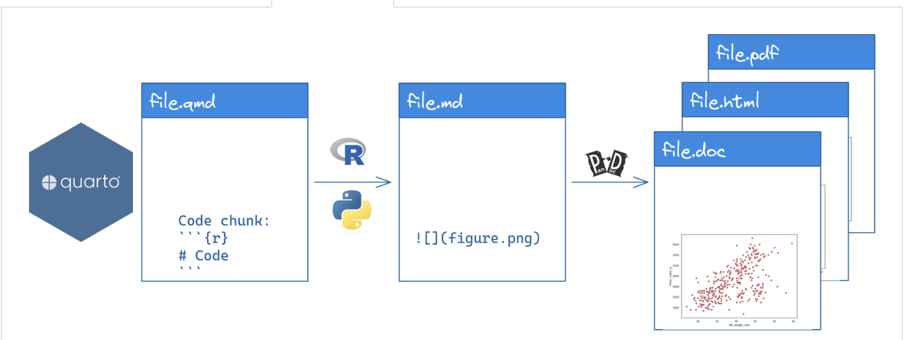
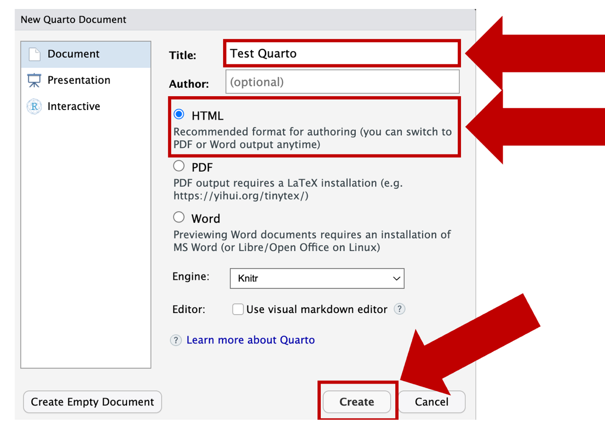
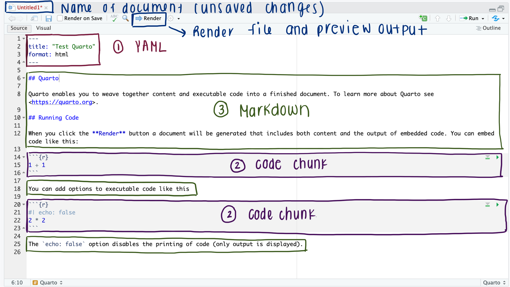
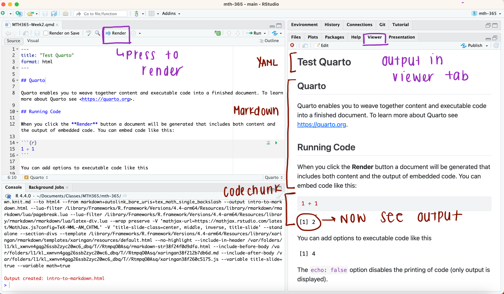
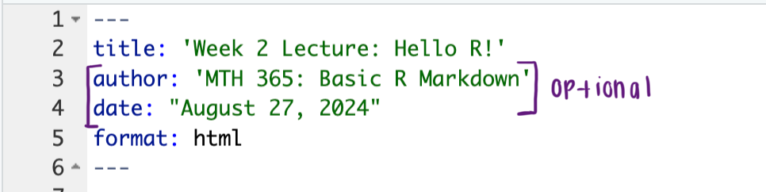
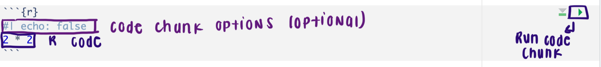
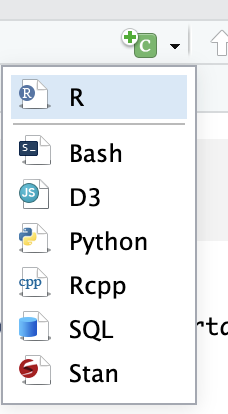
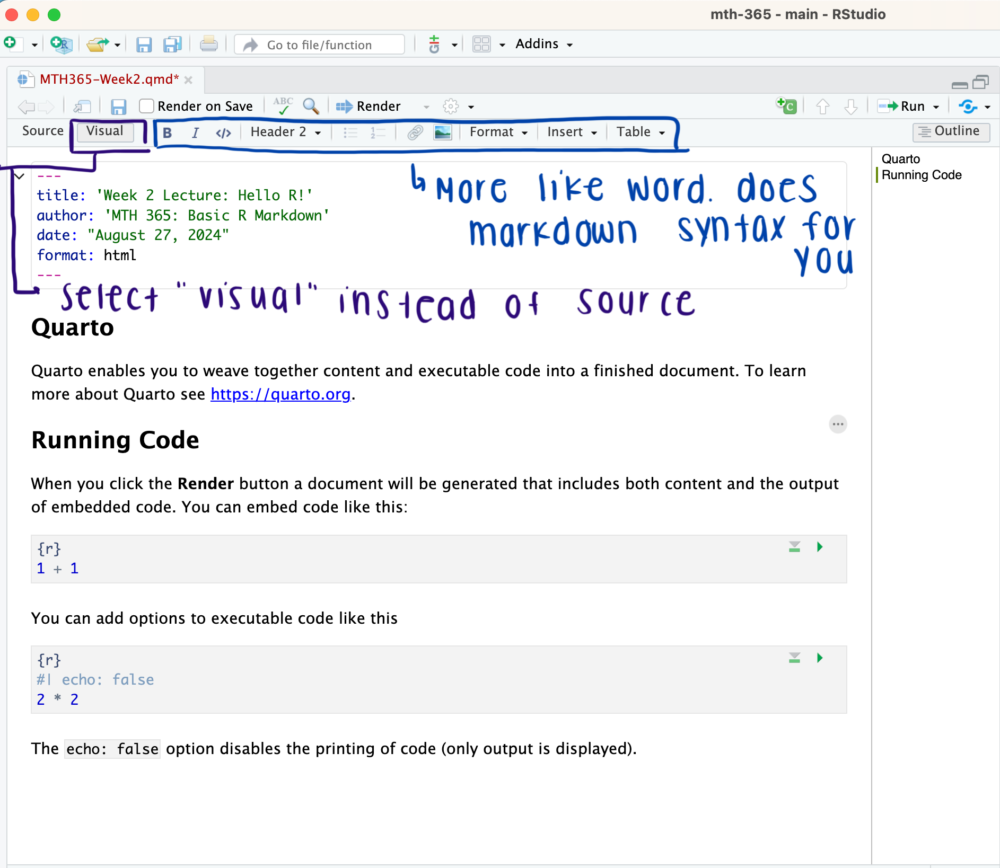

```{r echo=FALSE, message=FALSE, warning = FALSE}
library(tidyverse)
library(knitr)

hook_output = knit_hooks$get('output')
knit_hooks$set(output = function(x, options) {
  # this hook is used only when the linewidth option is not NULL
  if (!is.null(n <- options$linewidth)) {
    x = xfun::split_lines(x)
    # any lines wider than n should be wrapped
    if (any(nchar(x) > n)) x = strwrap(x, width = n)
    x = paste(x, collapse = '\n')
  }
  hook_output(x, options)
})

```

## Announcements

- Start Lab 1 in class on Thursday!
  + Due **Thursday January 29th, 2025 at 11:59 pm**
  + There will be an in-class portion that you will work on in groups
  
  
<br>
<br>
<br>
<br>
<br>
<br>
<br>
<br>
<br>
<br>
<br>
<br>
<br>
<br>


**Document**: DSC365-quarto-intro-student.qmd

---
### Scripts + Notebooks

.pull-left[
**Scripts**

+ **Scripts:** (`File > New File > R Script`) are files of code that are meant to be run on their own.
+ A file you can save to easily return to later.
+ You can run code interactively in a script by:
  + highlighting lines of code and hitting run.
  + placing your cursor on a line of code and hitting `ctrl + enter` or `command + enter`.

].pull-right[

**Notebooks:**

Notebooks are implementations of **literate programming**.

+ They allow you to integrate code, output, text, images, etc. into a single document.
+ E.g.,
  + R Markdown notebook
  + **Quarto notebook**
  + Jupyter notebook

]

---
### Replicability vs Reproducability

The notion that scientific findings can be confirmed repeatedly through replication is fundamental to science.

- Replicability means that you get the same results with different data
- **Reproducibility** means that you get the same results with the same data

<br>

The [replication crisis](https://en.wikipedia.org/wiki/Replication_crisis) is a very real problem for modern science. 
- More than 15 years ago, [Ioannidis (2005)](https://pmc.ncbi.nlm.nih.gov/articles/PMC1182327/#glossary1) argued that “most published research findings are false.”
- It now appears that even among peer-reviewed, published scientific articles, many of the findings—which are supported by experimental and statistical evidence—do not hold up under the scrutiny of replication. 

---
### Reproducability

What you are probably using to write:
- Microsoft Word
- Latex/Overleaf
- Google Docs

However, how get R code into these documents?
  - Modern software tools allow the analysis to be repeated at the push of a button

---
### Literate Programing

A programming method where you explain code in natural language (ex. English) in roughly the same place that you write the code.
  - Use it to explain the purpose of our code and how to use it

<br>

Available Literate Programming options with R

- `knitr` is primarily focused on the creation of Rnw (r no weave) files, which are essentially LaTeX files with R code inside. Rnw files are compiled into pdfs.
- `rmarkdown` uses Rmd or Rmarkdown files, which can then be compiled into many different formats: pdf, html, markdown, Microsoft Word.
- `quarto` uses qmd files, which are compiled into many different formats: pdf, html, markdown, Microsoft Word.


---
### Knit what?

- Quarto adds (renders) `R` code into your document so that all of the files for a particular experiment are in one place.
  - Compiling the document also runs the `R` code, so one button press runs your statistical analysis and places it in your document.
  - Integrates `R` output with the document text so that pictures, tables, and numerical data are all dependent on the `R` code.
- Produces beautiful, seamless integration of statistical analysis with scientific writing

```{r, echo=FALSE, out.height="65%", out.width="90%", fig.align='center', fig.alt="The rendering process for how a .qmd file becomes a html or pdf document. First the R code is ran and the outputs are translated into markdown languange. Then the markdown language is translated into a html or pdf through Pandoc."}

```


---
### Reproduceable Research

How does this help with reproduceable research?
- Journals often require code and data to be included in a paper submission so the analysis can be reproduced
- Statistical analyses are often re-used for multiple similar experiments (replication)
- We don't always comment code when we write it (though we should) - `quarto` provides context for the code by including the writeup with the code.

---
### What is Quarto?

- Allows you to "weave together narrative text and code to produce elegantly formatted output as documents, web pages, blog posts, books and more!" ([source](https://quarto.org/docs/faq/rmarkdown.html))
- R developed *R Markdown* to create documents that include R code, and *Quarto* is their attempt to bring *R Markdown* to everyone.
  - Developed to be multilingual, beginning with R, Python and Javascript.

<br>

Most of what we do today can be found in the [Quarto Website](https://quarto.org/docs/get-started/hello/rstudio.html) 

---
### Set-Up

+ Install the Necessary Packages
```{r, eval = FALSE}
install.packages(c("knitr", "rmarkdown"))
```
  - This alone will allow you to create `HTML` and Word documents (if you have Word installed)

+ If you want to create pdfs (and don't have a Latex installation): install TinyTex
```{r, eval = FALSE}
install.packages("tinytex")
library(tinytex)
install_tinytex()
```

---
### Creating a Quarto Document

File -> New File -> Quarto Document 

```{r, echo=FALSE, out.height="65%", out.width="90%", fig.align='center', fig.alt = "Screenshot of the window that appears when you create a new quarto file. The first highlighted box is where you put your title. The second highlighted box indicates which output format you want your document to render to. The final highlighted box at the bottom will create a .qmd document with those two specifications."}


```

---
### Contents of a .qmd

1. An (optional) YAML header surrounded by `---s`
2. Code chunks beginning with ````{r}`
3. Text mixed with simple text formatting (the markdown)

```{r, echo=FALSE, out.height="65%", out.width="90%", fig.align='center', fig.alt = "A Screenshot of a simple Quarto document. Labeled are the three pieces of content found in a qmd document."}

```

---
### Let's Render this document

```{r, echo=FALSE, fig.align='center', fig.alt="Screenshot of RStudio from after a Quarto document is rendered. The rendered document appears on the right within the Viewer Tab."}

```


---
### YAML

The stuff at the top of the .amd file (called YAML front matter) tells **quarto** what output format you want. 

```{r, echo=FALSE, out.height="40%", out.width="60%", fig.align='center', fig.alt="Zoomed in screenshot of the YAML, which is located at the top of the Quarto document. The title and format of the output is requried, but the author and date are optional pieces."}

```

<br>

In this case, when you click "Render", RStudio calls `quarto::quarto_render("document-name.qmd", , output_format = "html")`. You can certainly change these default values. 

---
### What is a Code Chunk?

In .qmd files, you can start/end a code chunk with three back-ticks. `quarto` knows that text is R code if it is included in a chunk.


```{r echo=FALSE, warning=FALSE, fig.alt="Zoomed in screenshot of a code chunk highlighting it's different components. In the upper right corner there is a green arrow, this is used to run a code chunk to preview results."}

```


When you render your .qmd file, Quarto will run each code chunk and embed the results beneath the code chunk in your final report.


---
### Create Code Chunk:

.pull-left[
Option 1:

```{r, echo=FALSE, out.height="70%", out.width="70%", fig.alt="To create a new code chunk, you can press the green squared with a plus sign, which is located to the top right of your editor window."}

```
].pull-right[
Option 2:

- Mac: `option+command+i`
- Windows: `control+alt+i`
]

---

### Code Chunk Options

There are many options to give you greater control over what is shown in the compiled document (identified by `#|` at the beginning of the line).

- eval=FALSE: don't run the code

- echo=FALSE: don't show the code

- warning=FALSE: don't add R's warnings to the pdf

- message=FALSE: don't show messages from R in the pdf

- cache=FALSE: re-run all of the code every time.

<br>

Let's look at these options in [the documentation](https://yihui.org/knitr/options/) 


---
### Markdown: Any Writing

```
This is a really smart sentence you wrote. 

### You can Bold your headers

You also emphasize *important* words. 

You can also **bold** important words.
```
This is a really smart sentence you wrote. 
### You can Bold your headers
You also emphasize *important* words. $\\$
You can also **bold** important words

<br>

[More Markdown Basics](https://srvanderplas.github.io/stat-computing-r-python/part-tools/06-documents.html#review-quarto-formatting)

---
### Rendering your Quarto Document

When you click **Render**:

-   Your file is saved.
-   The R code written in your *.qmd* file gets run **in order**.
    -   It starts from scratch, even if you previously ran some of the code.
-   A new file is created.
    -   If your Quarto file is called "Lab1.qmd", then a file called "Lab1.html" will be created.
    -   This will be saved in the same folder as "Lab1.qmd".

---
### Visual Editor

```{r, echo=FALSE, fig.align='center', fig.alt="Screenshot of the Editor Window if you choose to use the visual editor. This will bring up options that look more like Word."}

```


---
### Next: Download Quarto Document from BlueLine
