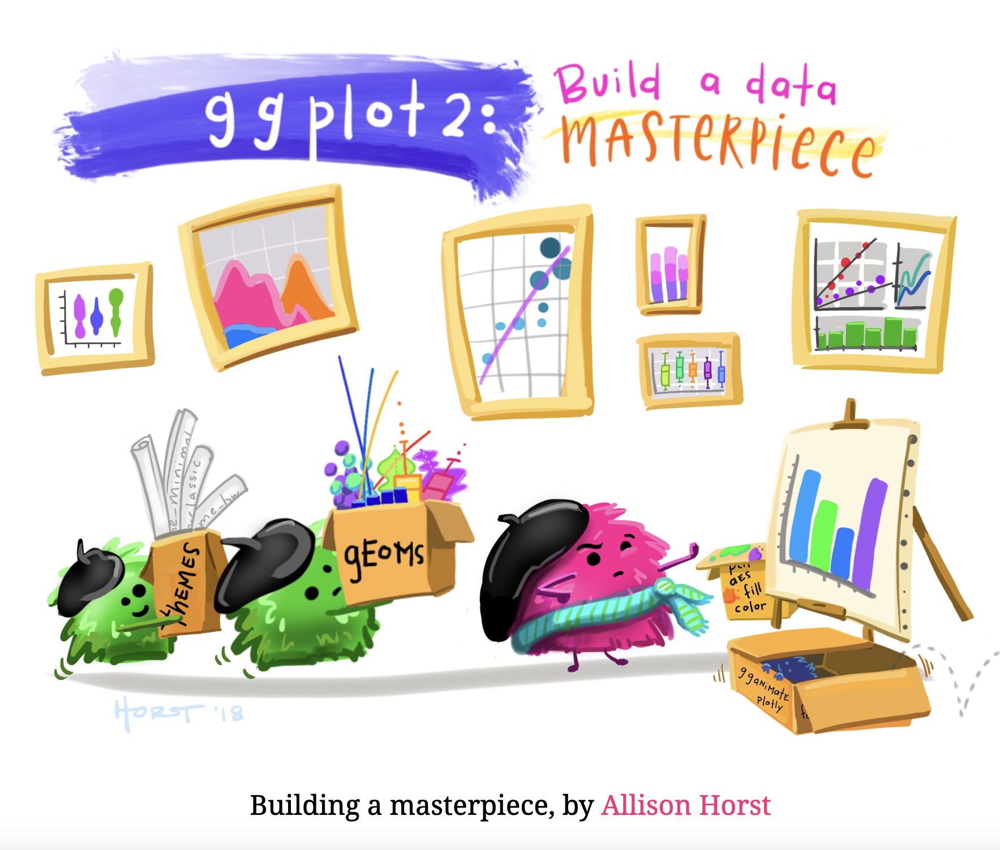
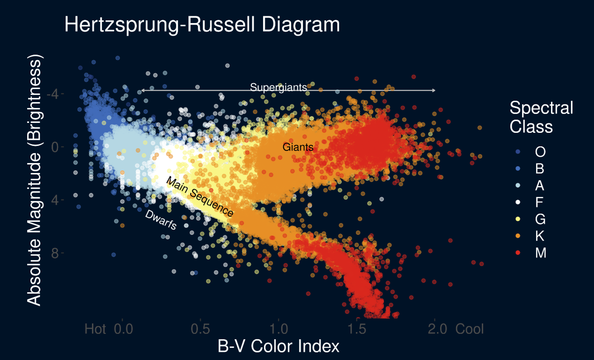
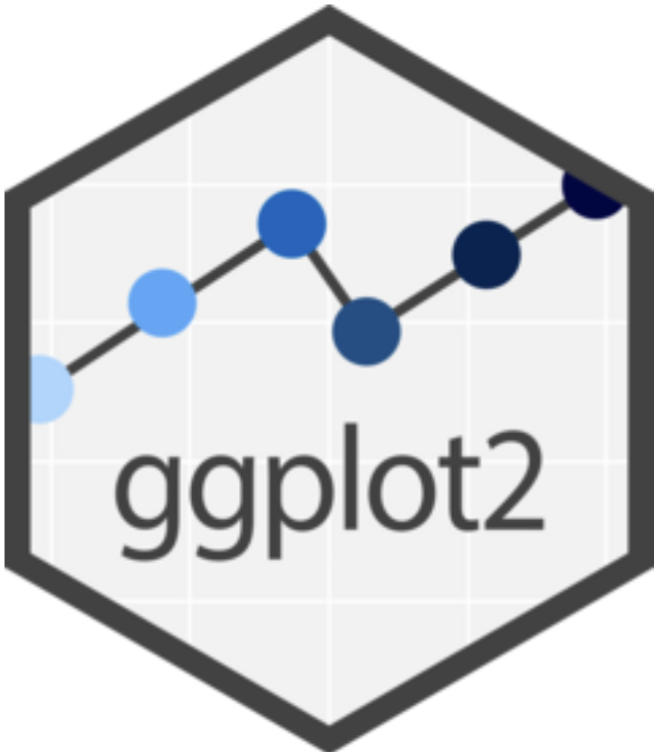
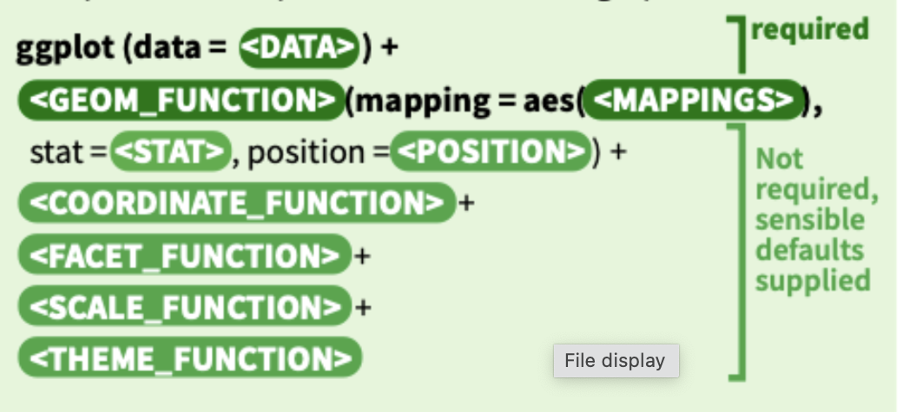
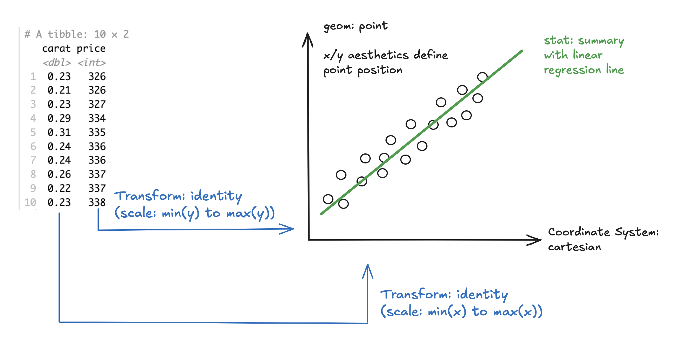

```{r echo=FALSE, message=FALSE, warning = FALSE}
library(tidyverse)
library(knitr)
library(ggsci)
library(gridExtra)

hook_output = knit_hooks$get('output')
knit_hooks$set(output = function(x, options) {
  # this hook is used only when the linewidth option is not NULL
  if (!is.null(n <- options$linewidth)) {
    x = xfun::split_lines(x)
    # any lines wider than n should be wrapped
    if (any(nchar(x) > n)) x = strwrap(x, width = n)
    x = paste(x, collapse = '\n')
  }
  hook_output(x, options)
})

```


### Announcements

- Start Lab 2 in class on Thursday!
  + Due **Tuesday February 3rd, 2026 at 11:59 pm** 
  
- Will Discuss Mini-Project 1 on Thursday
  + Due **Thursday February 12th, 2026 at 3:29 pm** (ie. before class starts)

- Quiz #1
  + Last 30 Minutes on Thursday February 5
  + Quarto, ggplot2, dplyr 

---

```{r, echo=FALSE, fig.align='center', fig.alt="Cartoon diplaying building a visualization like an artist paints a painting."}



```


---
### Why visualize?

Our brain is good at processing large amounts of data quickly!

<br>

**Useful at two point in Data Science Cycle**
+ Exploratory Data Analysis (EDA)
+ Communicating Information


```{r, echo=FALSE, fig.align='center', out.width="70%", fig.alt="The Hertzsprung-Russell Diagram displaying the relationshing between the brightness and and color of starts and how this relationship also shows the lifecycle of the star."}



```

---
class:primary
### Datasaurus Part 2: Summary Statistics

<br>
<br>

```{r, quartet-summary, echo=FALSE}
library(datasauRus)

data("datasaurus_dozen")

datasaurus_dozen_filter <- filter(datasaurus_dozen, dataset == "dino" | dataset == "star"| dataset == "v_lines"| dataset == "bullseye" | dataset == "dots" | dataset == "away")

quartet_summary <-   datasaurus_dozen_filter %>% 
    group_by(dataset) %>% 
    summarize(
      mean_x    = mean(x),
      mean_y    = mean(y),
      std_dev_x = sd(x),
      std_dev_y = sd(y),
      corr_x_y  = cor(x, y)
    )

quartet_summary %>%
  knitr::kable(digits = 3)
```

---
class:primary
### Datasaurus: Plots

```{r, , quartet-plots, fig.height = 7, fig.width = 9, fig.align = "center", echo = FALSE, fig.alt="Visualization of scatterplots for six datasets from the datasaurus dozen dataset. Shows that while these datasets all have the same correlation coefficent, the plots show very different types of relationships."}

ggplot(datasaurus_dozen_filter, aes(x = x, y = y, colour = dataset))+
    geom_point()+
    #theme_void()+
    theme(legend.position = "none")+
    facet_wrap(~dataset, ncol = 3)
```


---
### Grammar of Graphics

Grammar of Graphics: grammatical rules for creating perceivable graphs
  
  - [Developed by Leland Wilkison](https://link.springer.com/book/10.1007/0-387-28695-0)

Instead of thinking about a limited set of graphs, think about graphical forms
  
  - Different types of graphs may appear completely distinct, but in actuality share many common elements

By making different visual choices, you can use graphs to highlight different aspects of the same data.

- For example, here are three ways of displaying the same data:

```{r plots-3, fig.align='bottom', fig.height=4.5, fig.width=15, echo = FALSE, fig.alt="Depiction of three different ways to display the same dataset about the frequency of diamond cut types. The first is a regular bar chart, the second is a filled bar chart and the last is a pie chart."}

data(diamonds)

# bar chart
gg1 <- ggplot(diamonds, aes(cut, fill=cut)) + 
  geom_bar() + 
  scale_x_discrete("") +
  ggtitle(label = "Bar Chart", subtitle = "Cartesian coordinates") +
  scale_fill_locuszoom() +
  theme(aspect.ratio = 1)

# stacked bar chart
gg2 <- ggplot(diamonds, aes(x = factor(1), fill=cut)) + 
  geom_bar(width = 1) + 
  scale_x_discrete("") +
  ggtitle(label = "Fill-Bar", subtitle = "Cartesian coordinates") +
  scale_fill_locuszoom() +
  theme(aspect.ratio = 1)

# pie chart
gg3 <- ggplot(diamonds, aes(x = factor(1), fill=cut)) + 
  geom_bar(width=1) + 
  coord_polar(theta = "y") + 
  scale_x_discrete("") +
  ggtitle(label = "Fill-Bar", subtitle = "Polar coordinates") +
  scale_fill_locuszoom() +
  theme(aspect.ratio = 1)

grid.arrange(gg1, gg2, gg3, ncol = 3, nrow = 1)
```


---
### ggplot

Based on The Grammar of Graphics where the components are independent, meaning we can generally change a component in isolation [(source)](https://www.tandfonline.com/doi/epdf/10.1198/jcgs.2009.07098?needAccess=true).


.pull-left[

```{r, echo=FALSE, out.width="40%", fig.align = "center", fig.alt="Hex logo for ggplot2 package."}



```
].pull-right[

```{r, echo=FALSE, out.width="100%", fig.align = "center", fig.alt="Code template to create a plot using the ggplot function."}



```

]

<br>
<br>
<br>
<br>
<br>

[Help Information](https://rstudio.github.io/cheatsheets/html/data-visualization.html)

---
### ggplot 2: specifications

A plot consists of several mostly independent specifications:

1. **aesthetics** - links between data variables and graphical features (position, color, shape, size)
2. **geometries** - geometric elements (points, lines, rectangles, text,...)
3. **scales** - scales map values in data space values in the aesthetic space. Scales change the coordinate space of an aesthetic, but don't change the underlying value (change at visual level, not mathematical)
4. **coordinate system** 
5. **statistics**: mean, quantiles, etc
6. **faceting** - facets allow you to split plot by other variables to produce many sub-plots
7. **theme** - formating items, such as background color, fonts, margins...

<br>
<br>

**Limitation**: tells us what words make up our graphical “sentences,” but offers no advice on how to write well


---
### Let's Build a Graph!

```{r}
library(tidyverse)
head(diamonds)
```

---
### Plot Plan

```{r, echo=FALSE, out.width="100%", fig.align = "center", fig.alt="Visualization relating variables in a dataset to its correpsonding components on a plot."}



```

---
### We Begin with the Data

```{r, fig.height=5, fig.width=10, echo = TRUE, fig.alt="Visualization of the gray plot background that is the default for ggplot. Happens when only call in the dataset but no specific variables."}
ggplot(data=diamonds) #<<
```

---
### Then we specify the aesthetic mappings

```{r, fig.width=10, fig.height=5, echo = TRUE, fig.alt="Builds on previous picture, where we now have added our two variables to the gpplot code. The appropriate axes labels now appear."}
ggplot(data=diamonds, aes(x=carat, y = price)) #<<
```

---
### Then we choose a geom

```{r, eval=FALSE, fig.height=5, fig.width=10, echo = TRUE}
ggplot(data=diamonds, aes(x=carat, y = price)) +
  geom_point() #<<
```

```{r, echo=FALSE, fig.width=10, fig.height=5, fig.alt="Builds on previous picture where we have now added a geometry, a point. So now a point is diplayed for each observation."}
ggplot(data = diamonds, aes(x = carat, y = price)) +
    geom_point() + 
    scale_color_locuszoom()
```

---
### We can then add an aesthetic

```{r, eval=FALSE, fig.width=10, fig.height=5, echo = TRUE}
ggplot(data = diamonds, aes(x = carat, y = price)) +
    geom_point(aes(colour = cut)) #<<
```

```{r, echo=FALSE, fig.width=10, fig.height=5, fig.alt="Identical to previous plot, except now each point is colored by the cut of the diamond for that observation."}
ggplot(data = diamonds, aes(x = carat, y = price)) +
    geom_point(aes(colour = cut)) + 
    scale_color_locuszoom()
```
---
### And add another layer

```{r, eval = FALSE, fig.width=10, fig.height=5, echo = TRUE}
ggplot(data = diamonds, aes(x = carat, y = price)) +
    geom_point(aes(colour = cut)) +
    geom_smooth() #<<
```

```{r, echo = FALSE, fig.width=10, fig.height=5, fig.alt="Identical to previous plot, except now we have added a line that summarises the relationship between carat and price."}
ggplot(data = diamonds, aes(x = carat, y = price)) +
    geom_point(aes(colour = cut)) +
    geom_smooth() + 
    scale_color_locuszoom()
```

---
### Mapping aesthetics vs setting aesthetics

```{r, fig.width=10, fig.height=5, eval = FALSE, echo = TRUE}
ggplot(data = diamonds, aes(x = carat, y = price) +
    geom_point(aes(colour = cut), size = 2, alpha = .5) + #<<
    geom_smooth(aes(fill = cut), colour = "lightgrey") #<<
```

```{r, fig.width=10, fig.height=5, echo = FALSE, fig.alt="Now instead of one line depicting the overall relationhip there are now five lines, one for each of the diamond cuts."}

ggplot(data = diamonds, aes(x = carat, y = price)) +
    geom_point(aes(colour = cut), size = 2, alpha = .5) + 
    scale_color_locuszoom() + 
    scale_fill_locuszoom() +
    geom_smooth(aes(fill = cut), colour = "lightgrey")
```

---
### Facet

```{r, fig.width=10, fig.height=5, eval = FALSE, echo = TRUE}
ggplot(data = diamonds, aes(x = carat, y = price)) +
    geom_point(aes(colour = cut), size = 2, alpha = .5) +
    geom_smooth(aes(fill = cut), colour = "lightgrey") +
    facet_wrap(~cut) #<<
```

```{r, fig.width=10, fig.height=5, echo = FALSE, fig.alt="Instead of maintaing all of this information on one plot, now we have broken out the data into five faceted plots, one for each cut, so now we can more easily visualize the relationship between carat and price for each diamond type."}

ggplot(data = diamonds, aes(x = carat, y = price)) +
    geom_point(aes(colour = cut), size = 2, alpha = .5) +
    geom_smooth(aes(fill = cut), colour = "lightgrey") +
    scale_color_locuszoom() + 
    scale_fill_locuszoom() +
    facet_wrap(~cut)
```


---
### What Type of Chart to Use?

- What type of variables are you working with? Numerical? Categorical?
- Number of observations?
- Important moderating variables?
- Use of small multiples?

<br>

[The R Graph Gallery](https://r-graph-gallery.com)

---
### Later: Graphical Perception

To visually display data, information is encoded into a graph. The viewer then visually decodes this information, known as graphical perception, to gain knowledge. A successful graphic allows the user to perform graphical perception accurately and efficiently

After we have chosen the appropriate plot to visualize the data, focus on these two principles:

- Keep it simple
- Show the data clearly

<br>

But for now, let's move to the .qmd document
