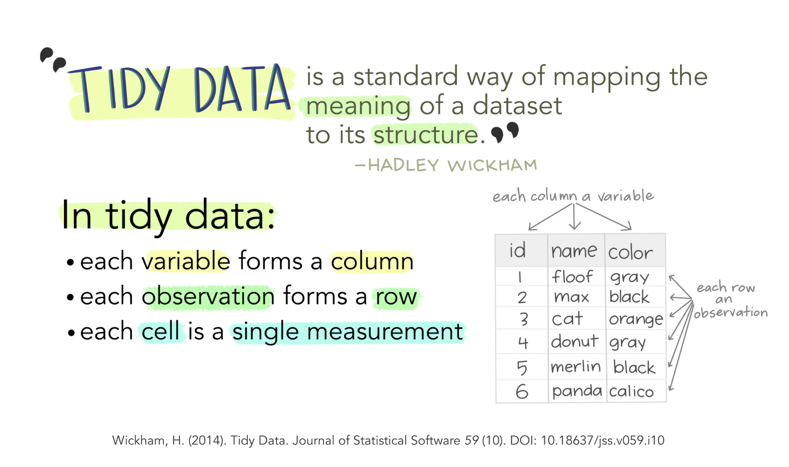

```{r echo=FALSE, message=FALSE, warning = FALSE}
library(tidyverse)
library(knitr)
library(ggsci)
library(gridExtra)

hook_output = knit_hooks$get('output')
knit_hooks$set(output = function(x, options) {
  # this hook is used only when the linewidth option is not NULL
  if (!is.null(n <- options$linewidth)) {
    x = xfun::split_lines(x)
    # any lines wider than n should be wrapped
    if (any(nchar(x) > n)) x = strwrap(x, width = n)
    x = paste(x, collapse = '\n')
  }
  hook_output(x, options)
})

```

```{r, include = F, eval = T, cache = T}
clean_file_name <- function(x) {
  basename(x) %>% str_remove("\\..*?$") %>% str_remove_all("[^[A-z0-9_]]")
}

img_modal <- function(src, alt = "", id = clean_file_name(src), other = "") {
  
  other_arg <- paste0("'", as.character(other), "'") %>%
    paste(names(other), ., sep = "=") %>%
    paste(collapse = " ")
  
  js <- glue::glue("<script>
        /* Get the modal*/
          var modal{id} = document.getElementById('modal{id}');
        /* Get the image and insert it inside the modal - use its 'alt' text as a caption*/
        var img{id} = document.getElementById('img{id}');
          var modalImg{id} = document.getElementById('imgmodal{id}');
          var captionText{id} = document.getElementById('caption{id}');
          img{id}.onclick = function(){{
            modal{id}.style.display = 'block';
            modalImg{id}.src = this.src;
            captionText{id}.innerHTML = this.alt;
          }}
          /* When the user clicks on the modalImg, close it*/
          modalImg{id}.onclick = function() {{
            modal{id}.style.display = 'none';
          }}
</script>")
  
  html <- glue::glue(
     " <!-- Trigger the Modal -->

<!-- The Modal -->
<div id='modal{id}' class='modal'>
  <!-- Modal Content (The Image) -->
  
  <!-- Modal Caption (Image Text) -->
  <div id='caption{id}' class='modal-caption'></div>
</div>
"
  )
  write(js, file = "js-addins.html", append = T)
  return(html)
}
# Clean the file out at the start of the compilation
write("", file = "js-addins.html")
```
class:inverse

<br><br><br>
## DSC365: Intro to Data Science
### Data Wrangling: dplyr
#### September 9, 2025

---
## Announcements

- Start Lab 3 in class on Thursday!
  + Due **Tuesday September 23th, 2025 at 11:59 pm** 
  
- **Mini-Project 1**
  + Due **Thursday September 18th, 2025 at 1:59 pm** (ie. before class starts)
  + Presentations during class that day


---
### What is Data Wrangling?

Most **Data Sets** are made up of *rows* and *columns*. They are  a collection of *values*: these can be *numbers* (quantitative) or character *strings* (qualitative)

**Data Wrangling** can be defined as the process of cleaning, organizing, and transforming  raw data into the desired format for analysts to use for prompt decision making. Also known as data cleaning.

```{r, echo=FALSE}

knitr::include_graphics("../../04-dplyr/slides/images/data-flowchart.png")

```
[Data Wrangling Flowchart](https://r4ds.had.co.nz/wrangle-intro.html) by Hadley Wickham and Garrett Grolemund

---

### Why do you need this "Data Wrangling" Skill?

- Data wrangling helps to improve data usability as it converts data into a compatible format for the end system.

- It helps to quickly build data flows within an intuitive user interface and easily schedule and automate the data-flow process.

- Integrates various types of information and their sources (like databases, web services, files, etc.)

- Help users to process very large volumes of data easily and easily share data-flow techniques.

[Source](https://www.simplilearn.com/data-wrangling-article#:~:text=Data%20wrangling%20helps%20to%20improve,automate%20the%20data%2Dflow%20process)

---
### What is tidy data?

```{r, echo=FALSE, out.width="90%"}



```

Real datasets can, and often do, violate the three principles of tidy data in almost every way imaginable! Even when they do, sometimes we don't need the whole data for analysis. 

---
### Data is usually in a spreadsheet format, but

There are different ways of encoding the same information

.pull-left[
#### Option 1

```{r, echo=FALSE, out.width="70%"}

knitr::include_graphics("../../04-dplyr/slides/images/untidy1.png")

```

#### Option 2
```{r, echo=FALSE, out.width="80%"}

knitr::include_graphics("../../04-dplyr/slides/images/untidy2.png")

```
].pull-right[
#### Option 3
```{r, echo=FALSE, out.width="80%"}

knitr::include_graphics("../../04-dplyr/slides/images/tidy-data.png")

```
]

--

Neither 1 or 2 are "clean" versions of the data: information is part of the data structure; some implicit information is assumed

---
### dplyr

dplyr is a grammar of data manipulation, providing a consistent set of verbs that help you solve the most common data manipulation challenges.

Rules of `dyplr`:

- First argument is always a data frame
- Subsequent arguments say what to do with that data frame
- Always returns a data frame

```{r, echo=FALSE, out.width="70%", fig.align='center'}


```

---
### dplyr uses the Pipe (%>%) Operator

Use the pipe operator to combine dplyr functions in chain, which allows us to perform more complicated data manipulations

In programming, a pipe is a technique for passing information from one process to another.

+ Syntax:  dataframe %>% dplyr_function()
+ read %>% as "then do"
+ f(x) %>% g(y) is equivalent to g(f(x),y)
+ Recently `R` has developed the native pipe operator: `|>`

```{r, echo=FALSE, fig.align='center'}


```

---
### dplyr Terminology

There are some of the primary dplyr verbs, representing distinct data analysis tasks:

`filter()`: Select specified rows of a data frame, produce subsets

`arrange()`: Reorder the rows of a data frame

`select()`: Select particular columns of a data frame

`mutate()`: Add new or change existing columns of the data frame (as functions of existing columns)

`summarise()`: Create collapsed summaries of a data frame

`group_by`: Introduce structure to a data frame

---
### `filter()`

.pull-left[

```{r, results='asis', echo=FALSE, fig.align='center'}

i1 <- img_modal(src = "./images/filter.png", alt = "by Allison Horst", other=list(width="100%"))

c(str_split(i1, "\\n", simplify = T)[1:2],
  str_split(i1, "\\n", simplify = T)[3:9]
  ) %>% paste(collapse = "\n") %>% cat()

```

].pull-right[

```{r, results='asis', echo=FALSE, fig.align='center'}

i2 <- img_modal(src = "./images/filter2.png", alt = "from MDSR book", other=list(width="100%"))

c(str_split(i2, "\\n", simplify = T)[1:2],
  str_split(i2, "\\n", simplify = T)[3:9]
  ) %>% paste(collapse = "\n") %>% cat()

```

]

---
### `select()`

.center[

```{r, results='asis', echo=FALSE, fig.align='center'}

i1 <- img_modal(src = "./images/select.png", alt = "from MDSR book", other=list(width="100%"))

c(str_split(i1, "\\n", simplify = T)[1:2],
  str_split(i1, "\\n", simplify = T)[3:9]
  ) %>% paste(collapse = "\n") %>% cat()

```

]

---
### `mutate()`

.pull-left[

```{r, results='asis', echo=FALSE, fig.align='center'}

i1 <- img_modal(src = "./images/mutate.png", alt = "by Allison Horst", other=list(width="100%"))

c(str_split(i1, "\\n", simplify = T)[1:2],
  str_split(i1, "\\n", simplify = T)[3:9]
  ) %>% paste(collapse = "\n") %>% cat()

```

].pull-right[

```{r, results='asis', echo=FALSE, fig.align='center'}

i2 <- img_modal(src = "./images/mutate2.png", alt = "from MDSR book", other=list(width="100%"))

c(str_split(i2, "\\n", simplify = T)[1:2],
  str_split(i2, "\\n", simplify = T)[3:9]
  ) %>% paste(collapse = "\n") %>% cat()

```

]

---
### `arrange()`

.center[

```{r, results='asis', echo=FALSE, fig.align='center'}

i1 <- img_modal(src = "./images/arrange.png", alt = "from MDSR book", other=list(width="100%"))

c(str_split(i1, "\\n", simplify = T)[1:2],
  str_split(i1, "\\n", simplify = T)[3:9]
  ) %>% paste(collapse = "\n") %>% cat()

```

]

---
### `summarize()`

.center[

```{r, results='asis', echo=FALSE, fig.align='center'}

i1 <- img_modal(src = "./images/summarize.png", alt = "from MDSR book", other=list(width="100%"))

c(str_split(i1, "\\n", simplify = T)[1:2],
  str_split(i1, "\\n", simplify = T)[3:9]
  ) %>% paste(collapse = "\n") %>% cat()

```

]
