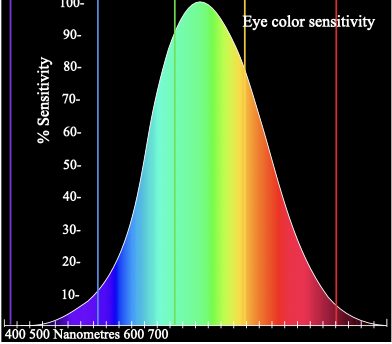
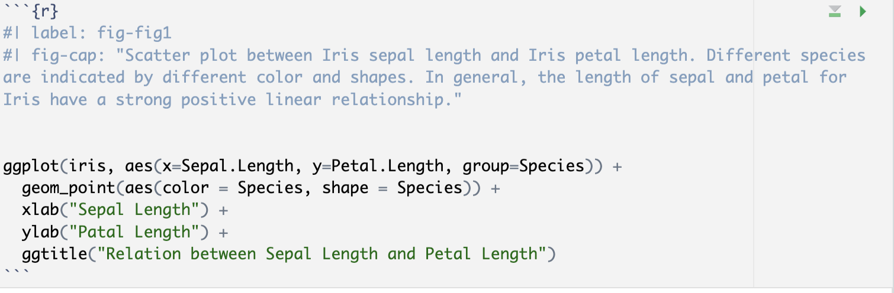
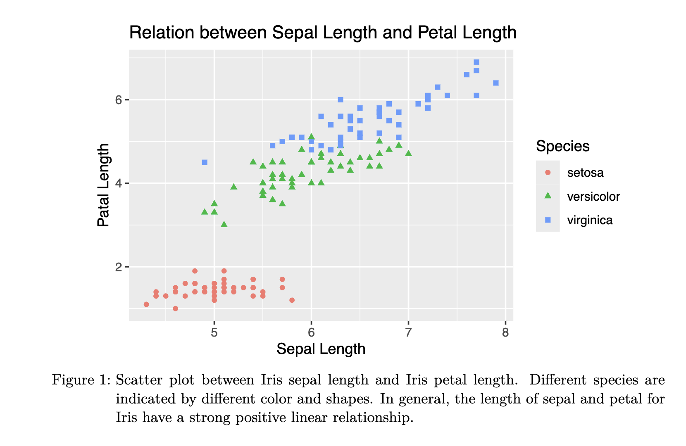

```{r echo=FALSE, message=FALSE, warning = FALSE}
library(tidyverse)
library(knitr)
library(RColorBrewer)

hook_output = knit_hooks$get('output')
knit_hooks$set(output = function(x, options) {
  # this hook is used only when the linewidth option is not NULL
  if (!is.null(n <- options$linewidth)) {
    x = xfun::split_lines(x)
    # any lines wider than n should be wrapped
    if (any(nchar(x) > n)) x = strwrap(x, width = n)
    x = paste(x, collapse = '\n')
  }
  hook_output(x, options)
})

```

```{r, include = F, eval = T, cache = T}
clean_file_name <- function(x) {
  basename(x) %>% str_remove("\\..*?$") %>% str_remove_all("[^[A-z0-9_]]")
}
img_modal <- function(src, alt = "", id = clean_file_name(src), other = "") {
  
  other_arg <- paste0("'", as.character(other), "'") %>%
    paste(names(other), ., sep = "=") %>%
    paste(collapse = " ")
  
  js <- glue::glue("<script>
        /* Get the modal*/
          var modal{id} = document.getElementById('modal{id}');
        /* Get the image and insert it inside the modal - use its 'alt' text as a caption*/
        var img{id} = document.getElementById('img{id}');
          var modalImg{id} = document.getElementById('imgmodal{id}');
          var captionText{id} = document.getElementById('caption{id}');
          img{id}.onclick = function(){{
            modal{id}.style.display = 'block';
            modalImg{id}.src = this.src;
            captionText{id}.innerHTML = this.alt;
          }}
          /* When the user clicks on the modalImg, close it*/
          modalImg{id}.onclick = function() {{
            modal{id}.style.display = 'none';
          }}
</script>")
  
  html <- glue::glue(
     " <!-- Trigger the Modal -->

<!-- The Modal -->
<div id='modal{id}' class='modal'>
  <!-- Modal Content (The Image) -->
  
  <!-- Modal Caption (Image Text) -->
  <div id='caption{id}' class='modal-caption'></div>
</div>
"
  )
  write(js, file = "js-addins.html", append = T)
  return(html)
}
# Clean the file out at the start of the compilation
write("", file = "js-addins.html")
```

class:inverse

<br><br><br>
## DSC365: Introduction to Data Science
### Data Communication
#### February 10, 2026

---
## Announcements

- Lab 3: Due **Tuesday February 17th, 2026 at 11:59 pm** 
  
- **Mini-Project 1**
  + Due **Thursday February 12th, 2026 at 3:29 pm** (ie. before class starts)
  + Presentations during class that day


---
class:inverse

<br>
<br>
<br>
<br>
<br>
<br>
<br>
<br>
<br>

.center[
## Graphical Perception
]

---
### Graphical Perception

To visually display data, information is encoded into a graph. The viewer then visually decodes this information, known as graphical perception, to gain knowledge. 

In previous weeks we have discussed how to choose the right plot to visualize the data. This week we will focus on the other two principles:

- Keep it simple
- Show the data clearly


---
### Keep it Simple

A general guideline is to use simplicity in the design. 

- Minimize the number of unique symbols
- A sample of graphics found that graphics with the best overall ratings had fewer features on average [(Source)](https://www.jstor.org/stable/24737226?seq=1). 
- Beauty with the addition of unnecessary features does not always equal good content

---
### Show the Data Clearly

Here authors wanted to display the relationship between the average lifespan and lifespan standard deviation of different countries by labeling each point by sex and education level. Additionally, they denoted the country, represented by each point, by including its name on the chart

.pull-left[
```{r, results='asis', echo=FALSE, fig.align='center', out.width="70%"}
i1 <- img_modal(src = "../slides/images/unclear-graph.png", alt = "Original plot that shows each observation on the same scatterplot, where different symbols are used to represent the differeng groups")

c(str_split(i1, "\\n", simplify = T)[1:2],
  str_split(i1, "\\n", simplify = T)[3:9]
  ) %>% paste(collapse = "\n") %>% cat()

```
].pull-right[
```{r, results='asis', echo=FALSE, fig.align='center'}
i1 <- img_modal(src = "../slides/images/better-graph.png", alt = "Improved visualization that facets each scatterplot by country so can reduce the clutter. problem from the original plot.")

c(str_split(i1, "\\n", simplify = T)[1:2],
  str_split(i1, "\\n", simplify = T)[3:9]
  ) %>% paste(collapse = "\n") %>% cat()

```
]
---
### Show the Data Clearly: Preattentive Features

Pre-Attentive Features are things that "jump out" in less than 500 ms [(source)](https://www.sciencedirect.com/science/article/abs/pii/S0734189X85800049)

+ Color, shape, angle, movement, spatial localization

There is a hierarchy of features
+ Color is stronger than shape

Reduces the amount of work users of your graph have to do when they view it [(source)](https://www.tandfonline.com/doi/full/10.1080/10618600.2016.1209116)

---
class:primary
### Find the Target

```{r, fig.align="center", out.height="60%", out.width="60%", echo = FALSE, fig.alt="Plot of green triangles with one green circle to demonstrate the preattentive feature of shape."}
data <- data.frame(expand.grid(x = 1:6, y = 1:6), color = factor(sample(c(1, 2), 36, replace = TRUE)))
data$x <- data$x + rnorm(36, 0, .25)
data$y <- data$y + rnorm(36, 0, .25)
data$shape <- factor(c(rep(2, 15), 1, rep(2,20)))

ggplot(data, aes(x, y)) + geom_point(aes(shape = shape), size = 5, colour = "#1B9E77") + theme_void() + theme(legend.position = "none")
```

???
Find the target?

how quickly did you spot the circle?

---
class:primary
### Find the Target

```{r, fig.align="center", out.height="60%", out.width="60%", echo = FALSE, fig.alt="Plot of red circles with one green circle to demonstrate the preattentive feature of color."}
data$shape <- factor(c(rep(2, 25), 1, rep(2, 10)))

ggplot(data, aes(x, y)) + geom_point(aes(colour = shape), size = 5, shape = I(19)) + theme_void() + theme(legend.position = "none") + scale_colour_brewer(palette="Dark2")
```


---
class:primary
### Preattentive Features

.pull-left[
**Shape/Color**: Dual-Encoded

```{r, fig.align="center", echo = FALSE, fig.alt="Demonstrates an example of a dual encoded plot, where each different group has a different shape and color."}
data$shape <- factor(sample(c(1, 2), 36, replace = TRUE))


ggplot(data, aes(x, y)) + geom_point(aes(colour = shape, shape = shape), size = 5) + theme_void() + theme(legend.position = "none") + scale_colour_brewer(palette="Dark2")
```
].pull-right[

**Shape/Color**: Separate Variables

```{r, fig.align="center", echo = FALSE, fig.alt="Demostrates an example with four groups of red circles, red trianges, green circles, and green triangles. Shows how it is difficult to quickly pick out the different groups."}
data$shape <- factor(sample(c(1, 2), 36, replace = TRUE))


ggplot(data, aes(x, y)) + geom_point(aes(colour = shape, shape = color), size = 5) + theme_void() + theme(legend.position = "none") + scale_colour_brewer(palette="Dark2")
```
]

---
### Show Data Clearly: Pie vs Bar Chart

.pull-left[
```{r diamonds1, echo = FALSE, fig.align='center', fig.alt="Pie Chart of the diamonds dataset showing the frequency of each cut in the dataset."}

diamonds_summary <- diamonds %>%
  group_by(cut) %>%
  summarise(Percent = n()/nrow(.) * 100)

ggplot(diamonds, aes(x = "", fill = cut)) + 
  geom_bar() +
  coord_polar(theta = "y") + ggtitle("Pie Chart")


```
].pull-right[

```{r diamonds2, echo = FALSE, fig.align='center', fig.alt="Bar Chart of the diamonds dataset showing the frequency of each cut in the dataset."}

diamonds %>% ggplot() + geom_bar(aes(x=cut,fill = cut)) + ggtitle("Bar Chart")

```
]


Anything that can be put into a pie chart can also be put into a bar chart

- Research has shown that people have more difficulty with angle measurements than length measurements, so always prefer bar chart over pie chart [(paper)](https://www.jstor.org/stable/2288400?seq=1). 


---
### Show Data Clearly: Color

+ Hue: shade of color (red, orange, yellow...)

+ Intensity: amount of color

+ Both color and hue are pre-attentive. Bigger contrast corresponds to faster detection.

+ When choosing color schemes, we will want mappings from data to color that are not just numerically but also perceptually uniform

+ Distinguish between sequential scales and categorical scales

+ Be conscious of what color means


<br>

[(source)](https://ieeexplore.ieee.org/document/773961)
---
### Color

.center[Our eyes are optimized for perceiving the yellow/green region]

```{r, echo=FALSE, fig.align='center', out.width="60%", fig.alt="Illustration of the color spectrum."}


```

---
### Gradients

Qualitative schemes: no more than 7 colors

```{r, echo=FALSE, fig.width=3, fig.height=1, out.height="35%", out.width="35%", warning=FALSE, fig.alt = "Example of a seven color qualitative color scheme."}

data <- data.frame(x = 1:7, 
                   blues = brewer.pal(7, "Blues"), 
                   set1 = brewer.pal(7, "Set1"), 
                   diverge = brewer.pal(7,"RdBu"))

qplot(xmin = x-.5, xmax = x+.5, ymin = 0, ymax = 1, data = data, geom = "rect", color = I("black"), fill = set1) + 
    scale_fill_identity() + 
    ylab("") + 
    xlab("") + 
    theme(axis.text = element_blank(), 
          axis.ticks = element_blank(), 
          rect = element_blank()) + 
    coord_fixed(ratio = 1) + 
    theme_void()
```

Quantitative schemes: use color gradient with only one hue for positive values

```{r, echo=FALSE, fig.width=3, fig.height=1, out.height="35%",  out.width="35%", warning=FALSE, fig.alt = "Example of a single hue quantiative color gradient."}

qplot(xmin = x-.5, xmax = x+.5, ymin = 0, ymax = 1, data = data, geom = "rect", color = I("black"), fill = blues) + 
    scale_fill_identity() + 
    ylab("") + 
    xlab("") + 
    theme(axis.text = element_blank(), 
          axis.ticks = element_blank(), 
          rect = element_blank()) + 
    coord_fixed(ratio = 1) + 
    theme_void()
```


Quantitative schemes: use color gradient with two hues for positive and negative values. Gradient should go through a light, neutral color (white)

```{r, echo=FALSE, fig.width=3, fig.height=1, out.height="35%", out.width="35%", warning=FALSE, fig.alt = "Example of a double hue quantiative color gradient where the colors transition through a neutral color of white."}

qplot(xmin = x-.5, xmax = x+.5, ymin = 0, ymax = 1, data = data, geom = "rect", color = I("black"), fill = diverge) + 
    scale_fill_identity() + 
    ylab("") + 
    xlab("") + 
    theme(axis.text = element_blank(), 
          axis.ticks = element_blank(), 
          rect = element_blank()) + 
    coord_fixed(ratio = 1) + 
    theme_void()
```


[(source)](https://www.zeileis.org/papers/Zeileis+Hornik+Murrell-2009.pdf)

---
### Color Blindness

Not everyone perceives color in the same way. Some individuals have [colorblindness or color deficiencies](https://en.wikipedia.org/wiki/Color_blindness).

You can take a test designed to screen for colorblindness [here](https://eyeque.com/color-blind-test/).

Suggestions:
+ Design for a black-and-white photocopier
+ Use a monochromatic color gradient scheme where possible.
+ Suggested 2-color gradient: blue/purple - white - orange
+ Utilize double encoding: use color and another aesthetic (line type, shape)
+ Avoid any scheme that uses green-yellow-red signaling if you have a target audience that may include colorblind people.
+ Can use [this website](https://colorbrewer2.org/#type=sequential&scheme=BuGn&n=3) to help pick palettes as well
+ The `viridis package` (from last week's lab) contains a set of color scales designed to span as wide a palette as possible.
---
### Example: Hair Color

The data `HairEyeColor` provides the information of hair colors and eye colors in a statistics class. The data is recorded in a three-way table. The first step is to convert the data into a column-wise data frame.

```{r, echo = FALSE}
data(HairEyeColor)
#HairEyeColor[,,1] #Male
#HairEyeColor[,,2] #Female

newdata_male = as.data.frame(HairEyeColor[,,1]) 
newdata_female = as.data.frame(HairEyeColor[,,2]) 
newdata = rbind(newdata_male, newdata_female)
newdata = newdata %>% 
  mutate(Gender = rep(c("Male", "Female"), each  = 16))

hairData = newdata %>% 
  group_by(Hair) %>%
  summarise(Freq = sum(Freq))

hairData
```

Suppose now we want to see the distribution of hair color in this class. What kind of the plot we should use?

---
### Example: Hair Color

What is the difference between these two?
.pull-left[

```{r, fig.alt="Bar chart displaying the frequency of each hair color in the data set, where color equals hair is used to color the boundary of each bar."}

hairData %>% 
  ggplot(aes(x=Hair, y=Freq)) + 
  geom_col(aes(color = Hair)) #<<
```


].pull-right[

```{r, fig.alt="Bar chart displaying the frequency of each hair color in the data set, where fill equals hair is used to color in the area of each bar."}

hairData %>% 
  ggplot(aes(x=Hair, y=Freq)) +  
  geom_col(aes(fill = Hair)) #<<
```

]

---
### Example: Hair Color

It is a little weird that the color in the visualization does not match the color. Let’s try to define the color by ourselves. 
```{r, fig.align='center', fig.height=5, fig.width=8, fig.alt="Bar chart displaying the frequency of each hair color in the data set, where we specify the specific colors for each bar."}

ggplot(hairData, aes(x = Hair, y = Freq)) + 
  geom_col(aes(fill = Hair)) +
  scale_fill_manual(breaks = c("Black", "Brown", "Red", "Blond"), #<<
                    values=c("black", "brown", "red", "yellow")) #<<
```

---
### Example: Hair Color

You may have realized that in the previous figure, the color red and brown are pretty close. For an extreme case, what if you have a reader who is color-blind? There are a lot of [research](https://jfly.uni-koeln.de/color/) on which palette then to use.

```{r, fig.height=4, fig.width=8, fig.align='center' , fig.alt="Bar chart displaying the frequency of each hair color in the data set, where we specify the specific colors for each bar using a color blind friendly pallette."}
cbPalette <- c("#000000","#E69F00","#56B4E9","#009E73","#F0E442")

ggplot(hairData, aes(x = Hair, y = Freq)) + 
  geom_col(aes(fill = Hair)) +
  scale_fill_manual(values=cbPalette)
```

---
### Try it for yourself!!

Now try by yourself (or with a group) with another type of figure.

(a). Use the iris data below. Plot the figure to show the relation between Sepal.Length and Petal.Length.
```{r}
data(iris)
```

(b). Use colors to distinguish the species. Which function you have used? fill or color?

(c). Use red to represents `virginica`, blue to represents `versicolor`, and yellow to represents `setosa`.

(d). Use the color blind friendly color to distinguish three different species

(e). Besides of the color, use different shape of the points to represents the difference (Hint: Use Google or the Help Documentation).


---
class:inverse

<br>
<br>
<br>
<br>
<br>
<br>
<br>
<br>
<br>

.center[
# Data Misrepresentation
]

---
### Common Ways to Misreprsent Data

- Scales!
- Omitting Data
- Cherry picking the data
- Misleading pie chart/Using the wrong chart type

<br>

```{r, results='asis', echo=FALSE, fig.align='center'}

i1 <- img_modal(src = "../slides/images/comp-graphs.png", alt = "Illustration of the impact of misleading scales on interpretation of a bar chart.")

c(str_split(i1, "\\n", simplify = T)[1:2],
  str_split(i1, "\\n", simplify = T)[3:9]
  ) %>% paste(collapse = "\n") %>% cat()

```

---
### What's Wrong with These Plots?

Identify the issues with the plots, and talk about how you would fix them?

.pull-left[
```{r, results='asis', echo=FALSE, fig.align='center', out.height=="80%"}

i1 <- img_modal(src = "../slides/images/bad-pie.PNG", alt = "Pie chart of how people voted for president in 2016.")
i3 <- img_modal(src = "../slides/images/bad-color.png", alt = "Map of suicide rates by country with a bad color scheme.")

c(str_split(i1, "\\n", simplify = T)[1:2],
  str_split(i3, "\\n", simplify = T)[1:2],
  str_split(i1, "\\n", simplify = T)[3:9],
  str_split(i3, "\\n", simplify = T)[3:9]
  ) %>% paste(collapse = "\n") %>% cat()

```
].pull-right[

```{r, results='asis', echo=FALSE, fig.align='center', out.width="90%"}

i2 <- img_modal(src = "../slides/images/bad-line.PNG", alt = "Line chart of Asian Hate Crime reports over time.")
i4 <- img_modal(src = "../slides/images/bad-bar.png", alt = "Bar Chart of Number of Covid-19 cases by country over time.")


c(str_split(i2, "\\n", simplify = T)[1:2],
  str_split(i4, "\\n", simplify = T)[1:2],
  str_split(i2, "\\n", simplify = T)[3:9],
  str_split(i4, "\\n", simplify = T)[3:9]
  ) %>% paste(collapse = "\n") %>% cat()

```

]


---
### Election Maps

.pull-left[
```{r, results='asis', echo=FALSE, fig.align='center'}

i1 <- img_modal(src = "../slides/images/election-state.png", alt = "Election Map that colors in each state by which presidential nominees won that states electoral votes.")
i3 <- img_modal(src = "../slides/images/election-pop.png", alt = "Election Map that incorporates information about population.")

c(str_split(i1, "\\n", simplify = T)[1:2],
  str_split(i3, "\\n", simplify = T)[1:2],
  str_split(i1, "\\n", simplify = T)[3:9],
  str_split(i3, "\\n", simplify = T)[3:9]
  ) %>% paste(collapse = "\n") %>% cat()

```
].pull-right[

```{r, results='asis', echo=FALSE, fig.align='center'}

i2 <- img_modal(src = "../slides/images/electoral.png", alt = "Election Map that displays the number of electoral votes each presidential candidate won as hexagons, where the hexagons are arranged in a similar shape as the United States.")


c(str_split(i2, "\\n", simplify = T)[1:2],
  str_split(i2, "\\n", simplify = T)[3:9]
  ) %>% paste(collapse = "\n") %>% cat()

```

<br>
<br>

[Other Examples](https://www.flerlagetwins.com/2020/10/presidential-election.html)

]

.center[
[Source 1](https://storymaps.arcgis.com/stories/427c500cfa5f459590671a8d060c4ab4) and [Source 2](https://medium.com/swlh/the-problem-with-election-maps-443b3a941dc7)
]
---
### Visualzing Uncertainty

- Uncertainty is fundamental to data analysis and models
- Effectively communicating uncertainty in visualization is hard and is still being researched. 
- Don't present the uncertainty information without describing what it means.


.pull-left[
```{r, results='asis', echo=FALSE, fig.align='center'}

i1 <- img_modal(src = "../slides/images/mean-interval.png", alt = "Visualization of a mean rating for different countries where confidence intervals are included to show uncertainty information.")

c(str_split(i1, "\\n", simplify = T)[1:2],
  str_split(i1, "\\n", simplify = T)[3:9]
  ) %>% paste(collapse = "\n") %>% cat()

```
].pull-right[
```{r, results='asis', echo=FALSE, fig.align='center'}

i3 <- img_modal(src = "../slides/images/hurricane.png", alt = "Visualization of different ways uncertainty information about hurricane paths can be incorporated onto a plot.")

c(str_split(i3, "\\n", simplify = T)[1:2],
  str_split(i3, "\\n", simplify = T)[3:9]
  ) %>% paste(collapse = "\n") %>% cat()

```
]

---
class:inverse

<br>
<br>
<br>
<br>
<br>
<br>
<br>
<br>
<br>

.center[
# Writing about Visualizations
]

---
### Writing About Your Figure

Your visualizations should include:

- Clearly labeled axes
- Clear and descriptive captions
- Readable and easily understandable legends (if applicable)

---
### Labels

(a). Use plain English $\\$
(b). If there is mathematically symbols in your label, use `expression`:

```{r, fig.height=4, fig.width=8, fig.align='center', fig.alt="Scatterplot which utilizes the expression function to add an exponent to an axis label."}
x = -5:10
y = x^2
xy = data.frame(x,y)
ggplot(xy, aes(x = x, y=y)) +
  geom_point() +
  xlab("X") + ylab(expression(X^2))#<<
```

---
### Captions

There are two ways of writing a caption:

1). In-Figure Style

```{r, fig.height=3.5, fig.width=8, fig.align='center', fig.alt="Example of visualization created with ggplot where we added a title."}

ggplot(iris, aes(x=Sepal.Length, y=Petal.Length, group=Species)) + 
  geom_point(aes(color = Species, shape = Species)) + 
  xlab("Sepal Length") + 
  ylab("Patal Length") +
  ggtitle("Relation between Sepal Length and Petal Length") #<<
```

---
### Captions

2). Formal report style: use descriptive caption

+ It is not included in the figure. Usually placed below the figure.
+ Starts with the word “figure” or “table” followed by a number and a colon
+ One sentence to clearly explained What and How is being compared
+ One sentence to summarize the main conclusion.
+ Any other necessary context

```{r, echo = FALSE, fig.align='center', fig.alt="Visualization showing how to create a figure caption using the code chunk options in quarto."}


```

**Note**: label not required, but can be useful for [cross-referencing](https://quarto.org/docs/authoring/cross-references.html)
---
### Captions

What this then looks like:

```{r, echo = FALSE, fig.align='center', fig.alt="Visualization showing how a figure caption created within a code chunk in quarto outputs in the rendered document."}


```


---
### Captions

The caption only shows in the rendered version of documents. Why we need a descriptive caption? How to check whether you have written a good descriptive caption?

- The reader can capture your main argument without seeing the figure
- The reader can capture the context of your figure without reading the other analysis in the formal report.

---
### Writing About Figures in Reports

A formal data analysis report requires you to answer the question with a figure and explain the potential reasons behind the figure image. Sometimes you need multiple figures to answer one question and sometimes you can answer multiple questions with one figure.

Once you generate one figures, here is what you should do:

- Re-introduce the visualization and main argument
- Cite any statistical evidence or figure characteristics to support your argument
- State secondary argument and other information
- Contrast with the other figures if necessary
- Provide potential reasons and explain the conclusion

---
### Example: Writing About Figures in Reports

Figure 2 indicates that there is no linear relationship between iris sepal width and petal width since the scatter plot did not show a clear linear shape on the distribution of the point.

Meanwhile, the three species does have clear different distributions of the sepal width and petal width and within a species, the the sepal width and petal width may have a positive linear relationship except Setosa, which does not have a clear trend.

The relative size of different iris species is similar to what we have found in Figure 1, where Virginica tends to have the largest size among all three while Setosa is the smallest. One of the potential reasons for the different sizes may be the habitat condition while Virginica tends to grow in the places with enough sunshine but Setosa prefers relatively dark and wet environment.

---
### Your Turn

1. Add a figure caption to one of your plots from the `iris` try for yourself example

2. Practice writing a couple of sentence about the plot chosen.

3. See if you can find your own misleading data visualizations (r/dataisugly sometimes has some "good" ones).


