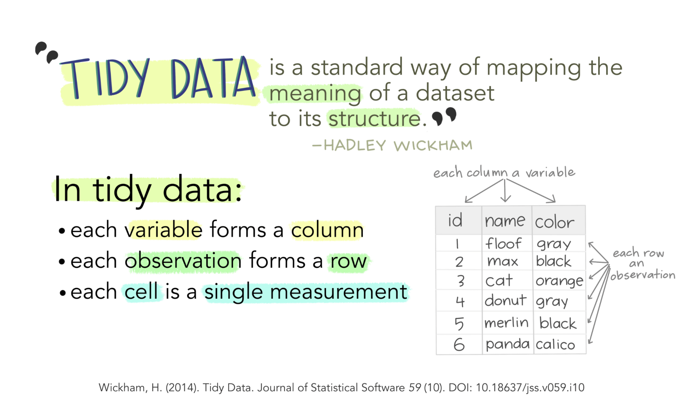
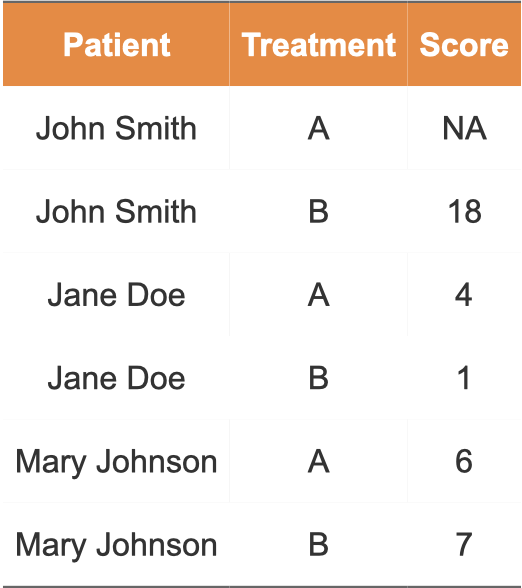
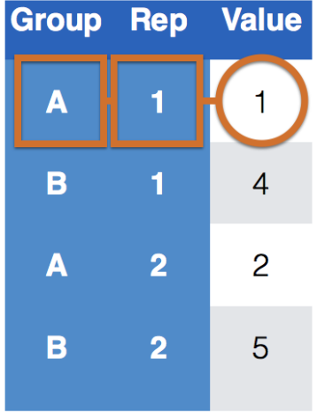
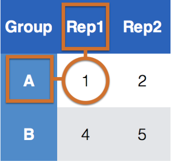
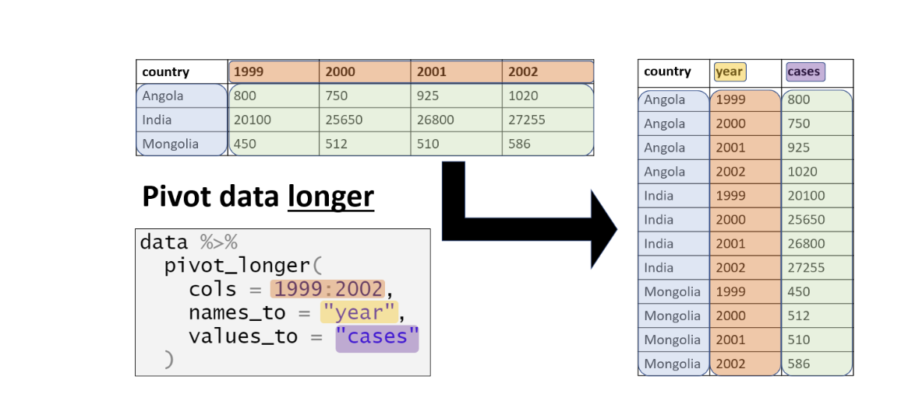
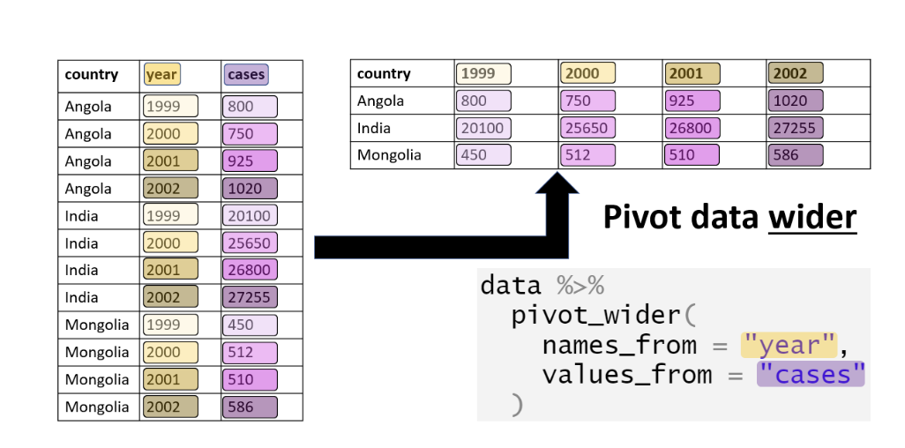

```{r echo=FALSE, message=FALSE, warning = FALSE}
library(tidyverse)
library(knitr)
library(RColorBrewer)


hook_output = knit_hooks$get('output')
knit_hooks$set(output = function(x, options) {
  # this hook is used only when the linewidth option is not NULL
  if (!is.null(n <- options$linewidth)) {
    x = xfun::split_lines(x)
    # any lines wider than n should be wrapped
    if (any(nchar(x) > n)) x = strwrap(x, width = n)
    x = paste(x, collapse = '\n')
  }
  hook_output(x, options)
})

```

## Announcements

**Lab 4**: Work day Tuesday February 24

- Due Tuesday March 3rd at 11:59 pm in Blueline

**Mini Project 2**

- Due Thursday March 19th at 11:59 in Blueline

---
class:inverse
<br>
<br>
<br>
<br>
<br>
<br>
<br>
<br>
.center[
## tidyr
]

---
### Throwback: What is tidy data?

```{r, echo=FALSE, fig.alt="This is a visualization connecting the definition of a tidy dataset to a picture of a dataset."}



```


---
### What Makes Data tidy? Key-Value Pairs

.pull-left[
```{r, echo=FALSE, fig.alt="Example of a tidy dataset. Have three columns for patient, treatment, and score. Has six rows, one for each person and treatment combination."}



```
].pull-right[

+ Treatment and Patient uniquely describe a single row in the dataset.

+ Treatment and Patient are key variables,

+ Score is a measurement variable

+ This makes Treatment-Patient and Score a key-value pair
]


---
### Key-Value Pairs

Key-Value pairs (KVP) - also attribute-value, field-value, name-value: abstract data representation that allows a lot of flexibility

One way of telling whether a data set is tidy is to check that all keys for a value are aligned in one row:

.pull-left[
```{r, echo=FALSE, fig.cap = "Tidy Data", out.height="70%", out.width="70%", fig.alt = "An example of a tidy dataset, highlighting the key-value pair to confirm that these values are aligned in a single row"}



```
].pull-right[

```{r, echo=FALSE, fig.cap="Untidy Data", out.width="90%", fig.align='center', fig.alt = "An example of an untidy dataset, highlighting the key-value pair. For the two key variables, one is a column header, and one is a row number. Hence the principles of tidy data are not met."}



```
]

---
### Example: Untidy Data

```{r, echo = FALSE}
library(reshape2)
data("french_fries")
head(french_fries, n = 2)
```

```{r, warning=FALSE, fig.height=3.5, fig.align='center', fig.width=8, fig.alt = "Boxplots comparing the ratings of different attributes of french fries."}

ggplot(french_fries) + 
  geom_boxplot(aes(x="1_buttery", y=buttery), fill="cyan") +
  geom_boxplot(aes(x = "2_grassy", y=grassy), fill="forestgreen") +
  geom_boxplot(aes(x = "3_painty", y=painty), fill="orchid1") +
  geom_boxplot(aes(x = "4_potato", y=potato), fill="navy") +
  geom_boxplot(aes(x = "5_rancid", y=rancid), fill="lavender") +
  xlab("variable") + ylab("rating")
```

---
### Tidy your data using pivot_longer

```{r, echo=FALSE, out.width="100%", fig.alt = "Illustration displaying how to transform a dataset from wide format to long format. Color is added to connect the same information in both datasets."}



```


When pivoting longer, you need to specify:

+ the cols (identifiers)
+ the names_to (new column name)
+ the values_to (measures from cols)


---
#### `pivot_longer`

```{r }
ff_long <- french_fries %>% 
  pivot_longer(cols=potato:painty, names_to = "var", 
               values_to = "rating")
```

```{r , echo = FALSE}
head(ff_long, n = 2)
```

--

```{r, warning=FALSE, fig.height=4, fig.width=8, fig.align='center', fig.alt = "Boxplots comparing the ratings of different attributes of french fries."}
ggplot(ff_long) + geom_boxplot(aes(x = var, y = rating, fill = var))
```

---
### And reverse: `pivot_wider`

Useful if we want to display things as a table:

```{r, echo=FALSE, out.width="80%", fig.alt = "Illustration displaying how to transform a dataset from long format to wide format. Color is added to connect the same information in both datasets."}



```


When pivoting wider, you need to specify:

- the names_from (column name that we want to widen)
- the values_from (measures from column we want to widen)

---
### `pivot_wider`

```{r}
ff_wide <- ff_long %>% 
  pivot_wider(names_from = var, 
              values_from = rating, 
              values_fill = NA)

head(ff_wide)
```


---
class:inverse
<br>
<br>
<br>
<br>
<br>
<br>
<br>
<br>
.center[
## Function Writing
]

---
### Why Write your own Functions?

Writing your own functions allow you to automate common tasks in a more powerful and general way than copy-and-pasting. 

Writing a function has three big advantages over using copy-and-paste:

- You can give a function an evocative name that makes your code easier to understand.

- As requirements change, you only need to update code in one place, instead of many.

- You eliminate the chance of making incidental mistakes when you copy and paste (i.e. updating a variable name in one place, but not in another).


---
### When Should You Write A Function?

You should consider writing a function whenever you’ve copied and pasted a block of code more than twice

For example, take a look at this code. What does it do? Notice any mistakes?

```{r}
df <- tibble::tibble(
  a = rnorm(10),
  b = rnorm(10),
  c = rnorm(10),
  d = rnorm(10)
)

df$a <- (df$a - min(df$a, na.rm = TRUE)) / 
  (max(df$a, na.rm = TRUE) - min(df$a, na.rm = TRUE))
df$b <- (df$b - min(df$b, na.rm = TRUE)) / 
  (max(df$b, na.rm = TRUE) - min(df$a, na.rm = TRUE))
df$c <- (df$c - min(df$c, na.rm = TRUE)) / 
  (max(df$c, na.rm = TRUE) - min(df$c, na.rm = TRUE))
df$d <- (df$d - min(df$d, na.rm = TRUE)) / 
  (max(df$d, na.rm = TRUE) - min(df$d, na.rm = TRUE))
```

---
### How do you Write a Function?

How many inputs do we have?

```{r}
(df$a - min(df$a, na.rm = TRUE)) /
  (max(df$a, na.rm = TRUE) - min(df$a, na.rm = TRUE))
```

---
### How do you Write a Function?

Three components of writing a function:

1. You need to pick a **name** for the function

2. You list the **inputs**, or arguments, to the function inside function.

3. You place the code you have developed in **body** of the function, a `{` block that immediately follows `function(...)`.

```{r, eval = FALSE}
function_name <- function(inputs separated by commas){
  #body: put code here
  # what to do with those inputs
}
```

By default they return the last value computed in the function

---
### Example:

```{r}
add_2 <- function(x){
  x + 2
  1000
}

add_2(2)
```

--

```{r}
add_2 <- function(x){
  x + 2
}

add_2(2)
```

---
### Back to Rescale Example

```{r}
rescale01 <- function(x) {
  rng <- range(x, na.rm = TRUE)
  (x - rng[1]) / (rng[2] - rng[1])
}

rescale01(df$a)
rescale01(df$b)
```

---
### Conditional Executuion

An `if` statement allows you to conditionally execute code. It looks like this:

```{r, eval = FALSE}
if (condition) {
  # code executed when condition is TRUE
} else {
  # code executed when condition is FALSE
}
```


Or can use the `ifelse` function:

```{r, eval = FALSE}
ifelse(condition, 
       code executed when condition is TRUE, 
       code executed when condition is FALSE)
```

---
### Example

```{r}
ifelse_example <- function(x){
  if(x > 0){
    "This value is positive"
  } else if (x == 0){
    "This value is 0"} else{
      "This value is negative"
    }
  }

ifelse_example(3)
ifelse_example(0)
ifelse_example(-2)
```

---
### Your Turn

1). Write your own mean function to find the mean of x :

$$\bar{x} = \frac{\sum^n_{i=1}x_i}{n}$$

```{r}
set.seed(4)
x <- round(runif(10, 0, 40),2)
x #use this data to test
```


2). You want to write a function to calculate a discount based on the purchase amount:

- If the amount is greater than or equal to 100, apply a 20% discount.
- If the amount is between 50 and 99.99, apply a 10% discount.
- If the amount is less than 50, no discount is applied.


---
class:inverse
<br>
<br>
<br>
<br>
<br>
<br>
<br>
<br>
.center[
## Data Types
]

---
### Data types in R

R is (usually) good at figuring out the best data type, but sometimes we'll need to take corrective action! The five data types we'll interact with the most are:

- Logical: Can take on values of either `TRUE` or `FALSE`
- Double: numeric data with decimals.
- Integer: are numeric data without decimals.
- Character: The data type character is used when storing text, known as strings in R.
  - The simplest ways to store data under the character format is by using "" around the piece of text
- Factor: Used to represent categories
  
---
### Coercion

When you mix data types within a vector, R will create the result with the data type that can most easily accommodate all the elements it contains. This conversion between modes of storage is called “coercion”. 

- When R converts the mode of storage based on its content, it is referred to as “implicit coercion”.

Use the `typeof()` function to find out.
.pull-left[
```{r}
typeof(c(1, "Hello"))
typeof(c(FALSE, 3L))
```
].pull-right[

```{r}
typeof(c(1.2, 3L))
typeof(NA)
```

]

---
### Example: Cat lovers

A survey asked respondents their name and number of cats. The instructions said to enter the number of cats as a numerical value.

```{r , eval=FALSE}
cat_lovers <- read.csv("cat_lovers.csv")
str(cat_lovers)
```

```{r, message=FALSE, echo=FALSE}
library(tidyverse)
# Make sure to change the file directory
cat_lovers <- read.csv("./data/cat_lovers.csv")

str(cat_lovers)
```

Any concerns with how the data was read in?

---
### Example: Cat lovers

Suppose we want to find the average number of cats:

```{r, error=TRUE}
cat_lovers %>% summarize(mean(number_of_cats))
```

--

How about removing the NA value?

```{r, error=TRUE}
cat_lovers %>% summarise(mean_cat = mean(number_of_cats, na.rm=TRUE))
```


---
### Example: Cat lovers

What is the type of the `number_of_cats` variable?
  
```{r}
typeof(cat_lovers$number_of_cats)
```

--

Are there any strange responses in the data?

```{r} 
cat_lovers[48:54,2]
```

---
### Example: Cat lovers

**Problem**: number_of_cats is a characters, when we want it to be a number. 

**Attempt 1**: convert to numeric, where the response that couldn't be converted to a number become `NA`

```{r}
cat_lovers = cat_lovers %>% 
  mutate(number_of_cats_new = as.numeric(number_of_cats))
str(cat_lovers)
```

---
### Example: Cat lovers

```{r}
cat_lovers[48:54,4]
cat_lovers %>% 
  summarize(mean(number_of_cats_new, na.rm = TRUE))
```

<br>

You can discard these two lines, but they are still useful information, just in different format. 

---
### Example: Cat lovers

**Attempt 2**: define a new variable?

```{r, message=FALSE, warning=FALSE}
cat_lovers2 <- cat_lovers %>%
  mutate(number_of_cats = case_when(
    name == "Ginger Clark" ~ 2,
    name == "Doug Bass"    ~ 3,
    .default = as.numeric(number_of_cats)
    )
  )

head(cat_lovers2, n = 3)

cat_lovers2 %>% summarise(mean_cats = mean(number_of_cats))
```

---
### Example: Cat lovers
You may want to save a copy of this new cleaned version of data. This way you can just read in your cleaned data, instead of running all the code each time you want to use that data set.

```{r, eval=FALSE}
write.csv(cat_lovers, file = "cat_lovers_clean.csv", 
          row.names = FALSE)
```

- Will save file into your working directory!!

---
### Data frames

A data frame is the most commonly used data structure in R, they are just a list of equal length vectors (usually atomic, but you can use generic as well). 

- Each vector is treated as a column and elements of the vectors as rows.

<br>
<br>
<br>

A `tibble` is a type of data frame that ... makes your life (i.e. data analysis) easier.

- Most often a data frame will be constructed by reading in from a file, but we can also create them from scratch.

---
### Example: 

How many respondents have below average number of cats?

```{r, warning=FALSE}
mean_cats = cat_lovers2 %>% 
  summarize(mean_cat = mean(number_of_cats))
mean_cats

cat_lovers2 %>% filter(number_of_cats < mean_cats) %>%
  nrow()
```

Do you see any problem here?
--

```{r}
class(mean_cats)
```


---
### A possible solution: 

`pull()` works like [[]] or `$` for data frames, and pulls out the value of a single column in a data frame. How does `pull()` work?

```{r}
mean_cats = cat_lovers2 %>% 
  summarize(mean_cat = mean(number_of_cats)) %>%
  pull() #<<
mean_cats

cat_lovers2 %>% filter(number_of_cats < mean_cats) %>%
  nrow()
```

`pull()` can be your new best friend, when used correctly.

---
### Factors

Factor: By default, R orders factors in alphabetical order. Use `fct_relevel` to force a particular order

```{r, fig.height=3, fig.width=8, fig.align='center'}
x = as.factor(cat_lovers$hand)
```

```{r, fig.height=3.5, fig.width=8, fig.align='center', fig.alt = "Bar chart of the frequency of different types of handedness in the cat lovers dataset."}
cat_lovers = cat_lovers %>%  
  mutate(hand=fct_relevel(hand,"left","ambidextrous","right"))
ggplot(cat_lovers, aes(x=hand, fill=hand)) + geom_bar()
```


---
### Overrriding Data Types

If you are absolutely sure of a data class, overwrite it in your tibble so that you don't need to keep having to keep track of it

```{r}
x <- "2"
class(x)
x <- as.numeric(x)
class(x)

```

---
### Overriding Data Types: Weird Things About `R`

```{r}
class(cat_lovers$hand)
typeof(cat_lovers$hand)
```

The `typeof function` is giving information that's at a "lower" level of abstraction. Factor variables (and also Dates) are stored as integers. 

  - Determines the (R internal) type or storage mode of any object
  
- `class`: a simple generic function mechanism which can be used for an object-oriented style of programming. 

---
### Recap

Be careful about data types/classes

  - If your data doesn't behave how you expect it to, implicit coercion might be the reason.
    +  Sometimes `R` makes silly assumptions about your data class 
  - Go in and investigate your data, apply the fix, _save your data_, live happily ever after.
  - Think about your data in context, e.g. 0/1 variable is most likely a `factor`
  - If you are absolutely sure of a data class, overwrite it in your tibble so that you don't need to keep having to keep track of it

