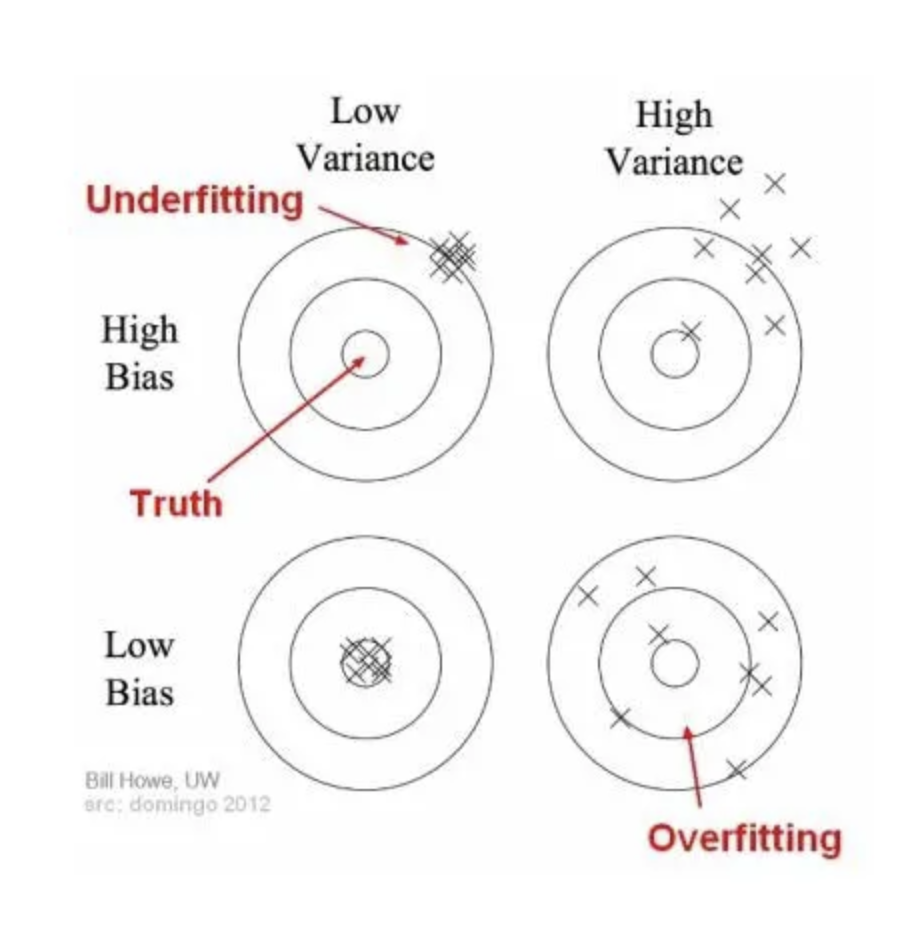
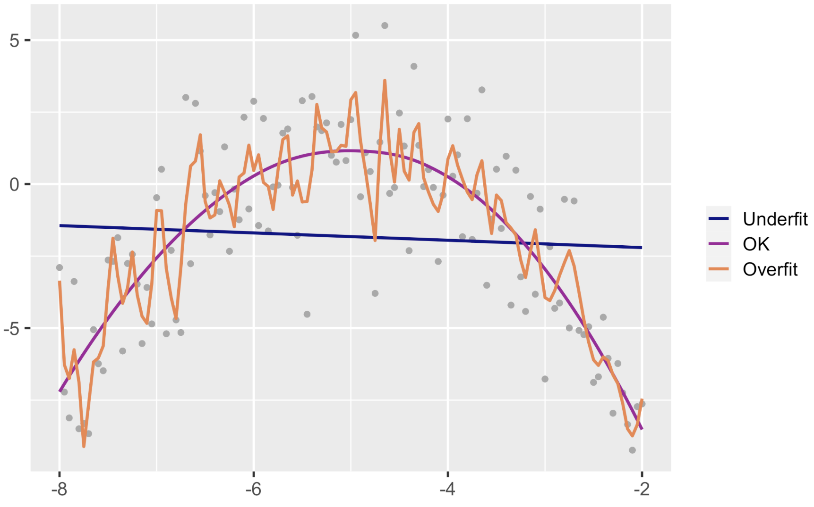
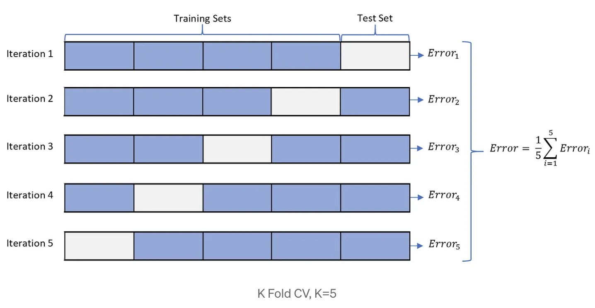
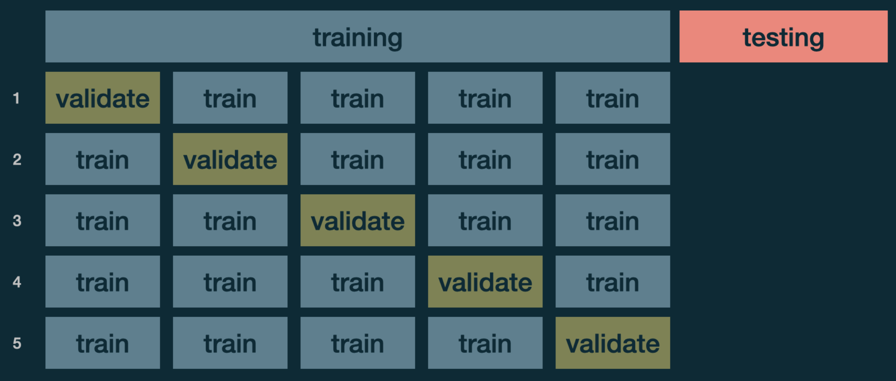
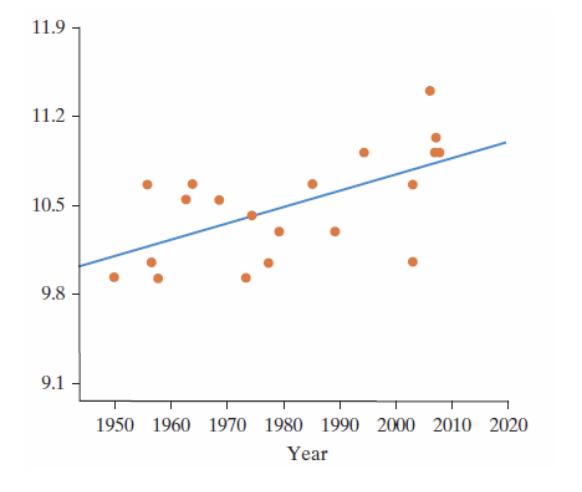
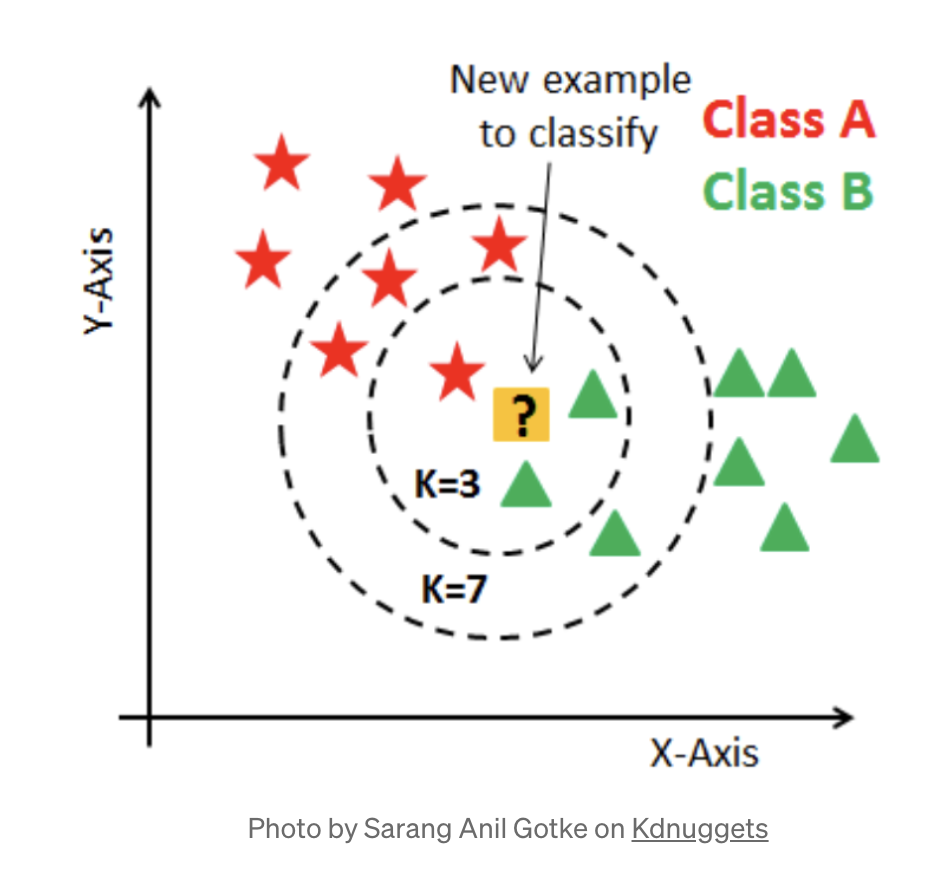
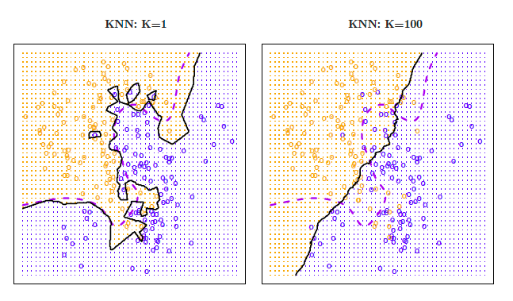

```{r echo=FALSE, message=FALSE, warning = FALSE}
library(tidyverse)
library(knitr)
library(RColorBrewer)
library(mosaic)
library(infer)


hook_output = knit_hooks$get('output')
knit_hooks$set(output = function(x, options) {
  # this hook is used only when the linewidth option is not NULL
  if (!is.null(n <- options$linewidth)) {
    x = xfun::split_lines(x)
    # any lines wider than n should be wrapped
    if (any(nchar(x) > n)) x = strwrap(x, width = n)
    x = paste(x, collapse = '\n')
  }
  hook_output(x, options)
})

```

### Announcements

**Lab 5** (Linear Models)

- Due Tuesday October 28th, 2025 at 11:59 pm in Blueline

**Mini Project 2**

- Due Thursday October 23 at 11:59 in Blueline

**Quiz 3**: in class Tuesday October 28th

- Covers: Prediction/KNN/Tree-Based Methods

---
class: inverse

<br>
<br>
<br>
<br>
<br>
<br>
<br>
<br>

.center[
## Cross Validation and Prediction
]

---
### Statistical Models


There are two things we can do with fitting a model:
1. Interpretation 
2. Prediction


Calculating a prediction is easy:

<br>
<br>
<br>

Getting a good prediction is hard:


---
### No one best model

.center["All models are wrong, some are just useful"]


- Prediction Accuracy and Model Interpretability Trade-Off

<br>
<br>
<br>

- Bias vs Variance Trade-Off

---
### Bias vs Variance

```{r echo=FALSE, fig.align='center', out.width="70%"}

```


---
### Over vs Under Fitting

```{r echo=FALSE, fig.align='center'}

```

---
### Splitting Our Data

- Several steps to create a useful statistical model: parameter estimation, model selection, performance assessment, etc.

  - Doing all of this on the entire data we have available can lead to overfitting
  
<br>
<br>

- To avoid overfitting, we split the data.


---
### Return to Flight Data

Consider a random sample of 1000 flights from NYC to Chicago in 2013. We want to create a model to predict arrival delay.

```{r, echo = FALSE, message=FALSE}
library(tidyverse)
library(nycflights13)
set.seed(14)
Chicago1000 <- flights %>%
  filter(dest %in% c('ORD', 'MDW'), !is.na(arr_delay)) %>% 
  sample_n(size=1000)
```


+ Split it into a training and a testing set.

```{r}
set.seed(365)
test_id <- sample(1:nrow(Chicago1000), 
                  size=round(0.2*nrow(Chicago1000)))
TEST <- Chicago1000[test_id,]
TRAIN <- Chicago1000[-test_id,]
```

+ Fit model to Training set:

```{r}
model1 = lm(arr_delay ~ hour + dep_delay, data = TRAIN)
```

+ Predict outcome on the Testing Set:

```{r}
predictions <- predict(model1, TEST)
```

---
### Evaluate Performance: RMSE

Root Mean Square Error (RMSE) - for numerical response


$$\text{RMSE} = \sqrt{\frac{\sum^{n}_{i=1}(y_i - \hat{y}_i)^2}{n}}$$


<br>
<br>
<br>
<br>


RMSE for Test Set:

```{r, message=FALSE}
library(Metrics)
rmse(TEST$arr_delay, predictions)
```


---
### Cross Validation

Potential Problem with a single split into training/testing: you evaluated the model only once and you are not sure your good result is by luck or not

<br>
<br>
<br>
<br>
<br>
<br>

We can easily do this using cross validation 

- A resampling method that uses different portions of the data to test and train a model on different iterations


---
### k-fold Cross Validation: Steps

- Split the dataset into k subsets randomly
  + Generally choose *k* = 5 or *k* = 10. 
- Use k-1 subsets for training the model
- Test the model against that one subset that was left in the previous step

<br>
<br>
<br>
<br>
  
```{r echo=FALSE, fig.align='center', out.width="80%"}

```

---
### k-fold Cross Validation

```{r, message=FALSE}
library(caret)
train_control <- trainControl(method = "cv", number = 5)

model <- train(arr_delay ~ hour + dep_delay, data = Chicago1000, 
               trControl = train_control, method = "lm")
model
```


---
### k-fold Cross Validation

Linear Regression does not have hyperparameters 

<br>
<br>
<br>

If you were working with a model with hyperparameters, best to do it this way:


```{r echo=FALSE, fig.align='center', out.width="80%"}

```


---
### Caution with Linear Models: Extrapolation

We extrapolate when we use the regression equation to produce a response value from an x-value that is outside the range of the observed x-values

**Example:** Relationship between year and diameter of a dinner plate.

```{r echo=FALSE, fig.align='center', out.width="50%"}

```


---
class: inverse

<br>
<br>
<br>
<br>
<br>
<br>
<br>
<br>

.center[
## k Nearest Neighbors (KNN)
]


---
### "Lazy" learning

__Lazy learning__: no assumptions necessary to classify data


__Example__: Consider the plot below - describe the relationship between x and y.

```{r, echo=FALSE, fig.align='center', fig.height=5.5, fig.width=8}
set.seed(365)
x1 <- runif(min=0.1, max=0.5, n=20)
x2 <- runif(min=0.3, max=0.7, n=20)
x3 <- runif(min=0.5, max=0.9, n=20)
y1 <- runif(min=0.5, max=0.7, n=20)
y2 <- runif(min=0.4, max=0.6, n=20)
y3 <- runif(min=0.2, max=0.5, n=20)
x <- c(x1, x2, x3)
y <- c(y1, y2, y3)
group <- c(rep('A', 20), rep('B', 20), rep('C', 20))
data <- as.data.frame(cbind(x, y, group))
colnames(data) <- c('x', 'y', 'group')
data$x <- as.numeric(data$x)
data$y <- as.numeric(data$y)
ggplot(data, aes(x=x, y=y))+geom_point(size = 3)
```

---
### "Lazy" learning

What if the data points belonged to three different groups, like this? How should a new data point, $(0.2, 0.5)$ be classified? What about $(0.4, 0.2)$?

```{r, echo=FALSE, fig.align='center', fig.height=6.5, fig.width=8}
new.pts <- data.frame(x = c(0.2, 0.4), y = c(0.5, 0.2), group=c('Point 1', 'Point 2'))
data.new <- rbind(data, new.pts)
ggplot(data.new, aes(x=x, y=y, group=group))+geom_point(size = 5, aes(col=group, pch=group))+scale_color_brewer(palette='Set1')
```

---
### Bayes Classifier

A good classifier minimizes Testing Error 

+ Bayes Classifier produce the lowest possible test error rate [(proof)](https://www.ee.columbia.edu/~vittorio/BayesProof.pdf)

Bayes Classifier assigns each observation to is most likely class using:

$$P(Y = j|X = x_0)$$
**Problem**: Don't know the conditional distribution

---
### $k$-nearest neighbor (KNN) classifier: 


A non-parametric supervised learning method that estimates the conditional probability.

<br>
<br>
<br>
<br>

```{r, echo=FALSE, out.width="55%", fig.align='center'}

```

---
### KNN for Classification Steps

In the KNN algorithm, $k$ specifies the number of neighbors and its algorithm is as follows:


---
### `knn()`

__Example__: Let's classify our new points 

```{r}
library(class)
```


.pull-left[

$k=2$?

```{r}
knnMod1 = knn(train=data[,1:2], 
          test = new.pts[,1:2], 
          cl = data$group, 
          k = 2, prob = TRUE)
knnMod1
```

].pull-right[

 $k=10$?

```{r}
knnMod2 = knn(train =data[,1:2], 
          test = new.pts[,1:2], 
          cl = data$group, 
          k = 10, prob = TRUE)
knnMod2
```

]
---
### Advantages and Disadvantages of KNN

Advantages:

<br>
<br>
<br>

Disdvantages:


---
### Choice of k

```{r, echo=FALSE, out.width="75%", fig.align='center'}

```


---
### Example: Credit Utilization

__Example__: Use KNN to predict which utilization quantile a new customer falls into based on their application data (credit rating and age)? 

```{r, echo = FALSE}
library(ISLR)
data(Credit)
```

```{r, echo=FALSE}
Credit <- Credit %>% mutate(Utilization = Balance/Limit) %>% 
  mutate(Quartile = ifelse(Utilization<0.01851, 'Q1', 
                           ifelse(Utilization<0.09873, 'Q2',
                           ifelse(Utilization<0.14325, 'Q3','Q4'))))

```

```{r, echo=FALSE, fig.align='center', fig.height=6.5, fig.width=11}
ggplot(Credit, aes(x=Age, y=Rating, group=Quartile)) + 
  geom_point(aes(col=Quartile, pch=Quartile), size = 3) + 
  scale_color_brewer(palette='Set1')
```

---
### Example: Credit Utilization

New applicants:

Name|Age|Credit Rating
---|---|---
Lacey|33|750
Zach|47|400
Ashlee|21|250

```{r, echo = FALSE}
apps <- data.frame(Age = c(33, 47, 21), 
                         Rating = c(750, 400, 250), 
                         Quartile=c('New', 'New', 'New'))
```


```{r, echo = FALSE}
old = Credit %>% dplyr::select(Age, Rating, Quartile)
full = rbind(old, apps)
full = full %>%
  mutate(Quartile = fct_relevel(Quartile,
                                "Q1", "Q2", "Q3", "Q4", "New"))
#str(full$Quartile)

```


```{r, fig.align='center', fig.height=4, fig.width=9, echo = FALSE}
ggplot(full, aes(x=Age, y=Rating, group=Quartile)) + 
  geom_point(aes(col=Quartile, pch=Quartile), size = 4) + 
  scale_color_brewer(palette='Set1')
```

---
### Example: Credit Utilization

.pull-left[
$k=20$?

```{r}
knn20 = knn(train = old[,1:2],
            test = apps[,1:2],
            cl = old[,3], 
            k = 20, prob = TRUE)
knn20
```

].pull-right[

$k=100$?

```{r}
knn100 = knn(train = old[,1:2],
            test = apps[,1:2],
            cl = old[,3], 
            k = 100, prob= TRUE)
knn100
```
]
---
### Evaluate Prediction Accuracy

__Example__:We want to know if KNN is effective at predicting quartile membership using an applicant's age, credit rating, income, number of existing credit cards, and education level. I'll randomly select 100 observations for testing, and assign the other 300 to my training data set.

```{r}
set.seed(365)
test_ID = sample(1:nrow(Credit), size = 100)
TEST = Credit[test_ID,]
TRAIN = Credit[-test_ID, ]

#only select variables we want
knn_train = TRAIN %>% dplyr::select(Age, Rating, Income, 
                                    Cards, Education)
knn_test = TEST %>% dplyr::select(Age, Rating, Income, 
                                  Cards, Education) 
```

---
### Evaluate models 

Now, we'll set the testing data as "new data", and make predictions using the k-nearest neighbors from the training data.

```{r}
knn50 = knn(train = knn_train, 
            test = knn_test,
            cl = TRAIN$Quartile, 
            k = 50, prob = TRUE)
knn50

```

---
### Evaluate models: Classification Accuracy 

Now, we'll set the testing data as "new data", and make predictions using the k-nearest neighbors from the training data.

```{r}
#Create Confusion Matrix
t = table(knn50, TEST$Quartile)
t

sum(diag(t))/nrow(TEST) #Classification Accuracy

```

---
### Scaling Data


<br>
<br>
<br>
<br>
<br>

```{r}
knn_train_scale <- knn_train %>% scale()
knn_test_scale <- knn_test %>% scale()

knn50_scale = knn(train = knn_train_scale, 
            test = knn_test_scale,
            cl = TRAIN$Quartile, 
            k = 50, prob = TRUE)


t_scale = table(knn50_scale, TEST$Quartile)

sum(diag(t_scale))/nrow(TEST) #Classification Accuracy

```

---
### KNN for Regression 

Can also use KNN to predict a quantiative response 
  + Alternative to Linear Regression

In the KNN algorithm, $k$ specifies the number of neighbors and its algorithm is as follows:


---
### Example: Credit Utilization


```{r}
knn_train = TRAIN %>% dplyr::select(Age, Rating, Income, Cards, 
                                    Education)
knn_test = TEST %>% dplyr::select(Age, Rating, Income, Cards, 
                                  Education) 

knn50 = FNN::knn.reg(train = knn_train, 
            test = knn_test,
            y = TRAIN$Utilization, 
            k = 50)

head(knn50$pred, n = 5)

rmse(TEST$Utilization, knn50$pred)

```

---
### Linear Regression vs KNN Regression

**In General**: 

.center[
Parametric approaches will outperform nonparametric approaches if the parametric form that has been selected is close to the true form of the data
]

<br>

So in situations where the relationship is nonlinear, KNN regression may perform better than Linear Regression

- But, Linear Regression may actually perform better than KNN as the number of variables (dimensions) increase
  + Curse of dimensionality

  
