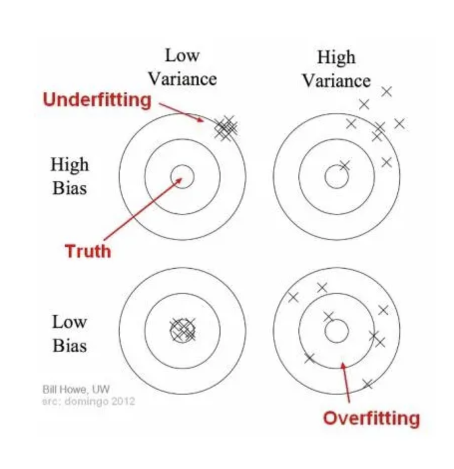
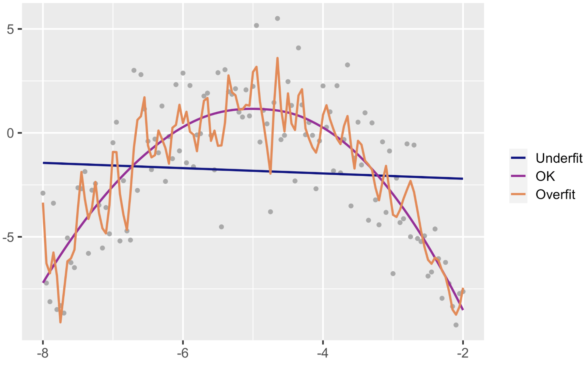
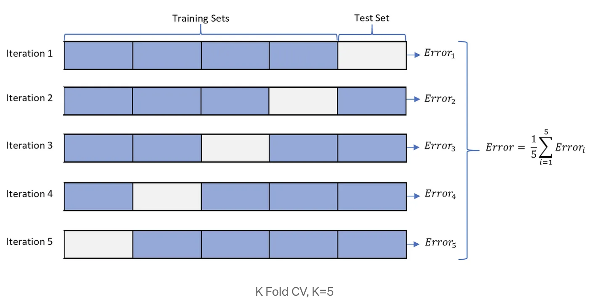
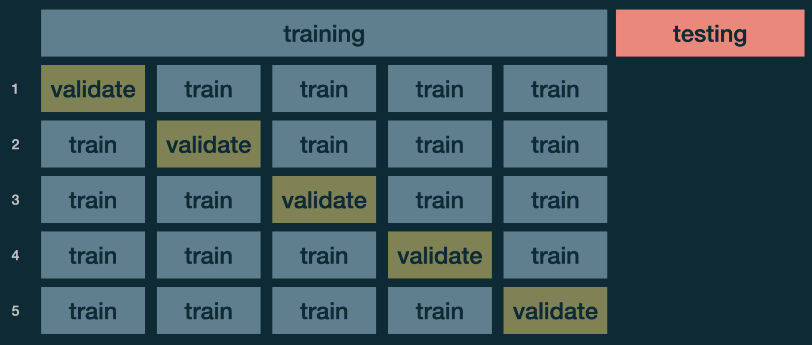
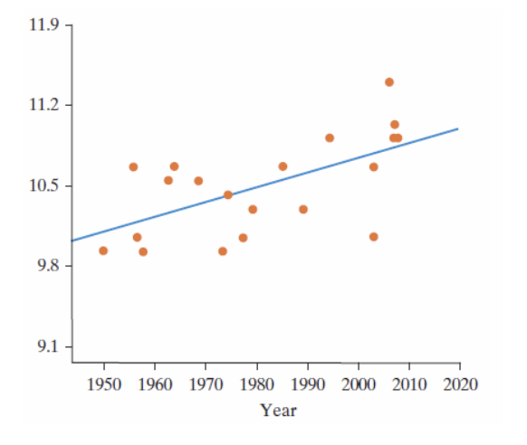

```{r echo=FALSE, message=FALSE, warning = FALSE}
library(tidyverse)
library(knitr)
library(RColorBrewer)
library(mosaic)
library(infer)


hook_output = knit_hooks$get('output')
knit_hooks$set(output = function(x, options) {
  # this hook is used only when the linewidth option is not NULL
  if (!is.null(n <- options$linewidth)) {
    x = xfun::split_lines(x)
    # any lines wider than n should be wrapped
    if (any(nchar(x) > n)) x = strwrap(x, width = n)
    x = paste(x, collapse = '\n')
  }
  hook_output(x, options)
})

```

### Announcements

**Mini Project 2**

- Due Thursday March 19th at 11:59 in Blueline

**Lab 5** (Linear Models)

- Due Tuesday March 24th at 11:59 pm in Blueline

**Quiz 3**: in class Thursday March 26th

- Covers: Prediction/KNN/Tree-Based Methods


---
### Branches of Machine Learning

**Machine Learning**:

<br>
<br>
<br>

**Supervised Learning**:

<br>
<br>
<br>
<br>

**Unsupervised Learning**:

---
### Models


There are two things we can do with fitting a model:
1. Interpretation 
2. Prediction


Calculating a prediction is easy:

<br>
<br>
<br>

Getting a good prediction is hard:


---
### No one best model

.center["All models are wrong, some are just useful"]


- Prediction Accuracy and Model Interpretability Trade-Off

<br>
<br>
<br>

- Bias vs Variance Trade-Off

---
### Bias vs Variance

```{r echo=FALSE, fig.align='center', out.width="70%", fig.alt = "Targets comparing bias and variance. Low variance and high bias has observations that are off target but are close together. High variance and high bias observations are also off target, but are more spread out. Low variance and low bias have observations that are on target with little variability. High variance and low bias has observations that are generally oon target but has a lot of variability."}


```


---
### Over vs Under Fitting

```{r echo=FALSE, fig.align='center', fig.alt="A plot to show the difference between over and underfitting. Over fitted curve follows the noise and is jagged as it follows the observations to closely. While the underfitted curve is just a line and doesn't capture the curvature in the data at all. A balance between these is necessary."}


```

---
### Splitting Our Data

- Several steps to create a useful statistical model: parameter estimation, model selection, performance assessment, etc.

  - Doing all of this on the entire data we have available can lead to overfitting
  
<br>
<br>
<br>

- To avoid overfitting, we split the data.


---
### Split Data: Return to Flight Data

Consider a random sample of 1000 flights from NYC to Chicago in 2013. We want to create a model to predict arrival delay.

```{r, echo = FALSE, message=FALSE}
library(tidyverse)
library(nycflights13)
set.seed(14)
Chicago1000 <- flights %>%
  filter(dest %in% c('ORD', 'MDW'), !is.na(arr_delay)) %>% 
  sample_n(size=1000)
```


+ Split it into a training and a testing set.

```{r}
set.seed(365)
test_id <- sample(1:nrow(Chicago1000), 
                  size=round(0.2*nrow(Chicago1000)))
TEST <- Chicago1000[test_id,]
TRAIN <- Chicago1000[-test_id,]
```

---
### Split Data: Return to Flight Data

+ Fit model to Training set:

```{r}
model1 = lm(arr_delay ~ hour + dep_delay, data = TRAIN)
```

<br>

+ Predict outcome on the Testing Set:

```{r}
predictions <- predict(model1, TEST)
head(predictions)
```

---
### Evaluate Performance: RMSE

Root Mean Square Error (RMSE) - for numerical response


$$\text{RMSE} = \sqrt{\frac{\sum^{n}_{i=1}(y_i - \hat{y}_i)^2}{n}}$$


<br>
<br>
<br>
<br>


RMSE for Test Set:

```{r, message=FALSE}
library(Metrics)
rmse(TEST$arr_delay, predictions)
```

---
### Evaluate Performance: MAE

Mean Absolute Error (MAE) - for numerical response

$$\text{MAE} = \frac{1}{n} \sum^{n}_{i=1}|y_i - \hat{y}_i|$$

<br>
<br>
<br>
<br>


MAE for Test Set:

```{r}
mae(TEST$arr_delay, predictions)
```

---
### Model Comparison

```{r, echo = FALSE}
options(pillar.sigfig = 5)
```


```{r}
model2 = lm(arr_delay ~ hour + dep_delay + distance, data = TRAIN)
predictions_distance <- predict(model2, TEST)

TEST %>% summarize(
  MSE1 = rmse(arr_delay, predictions),
  MSE2 = rmse(arr_delay, predictions_distance))

TEST %>% summarize(
  MAE1 = mae(arr_delay, predictions),
  MAE2 = mae(arr_delay, predictions_distance))

```

---
### Cross Validation

Potential Problem with a single split into training/testing: you evaluated the model only once and you are not sure your good result is by luck or not

<br>
<br>
<br>
<br>
<br>
<br>
<br>
<br>

We can easily do this using cross validation 

- A resampling method that uses different portions of the data to test and train a model on different iterations


---
### k-fold Cross Validation: Steps

- Split the dataset into k subsets randomly
  + Generally choose *k* = 5 or *k* = 10. 
- Use k-1 subsets for training the model
- Test the model against that one subset that was left in the previous step

<br>
<br>
<br>
<br>
  
```{r echo=FALSE, fig.align='center', out.width="80%", fig.alt = "Visual depiction of 5-fold cross validation with no validation set. The data is split into five sections where eachs section becomes the testing set one time resulting in 5 iterations. The average of the error for each of these iterations is calulcated and returned."}


```

---
### k-fold Cross Validation

```{r, message=FALSE}
library(caret)
train_control <- trainControl(method = "cv", number = 5)

model <- train(arr_delay ~ hour + dep_delay, data = Chicago1000, 
               trControl = train_control, method = "lm")
model
```


---
### k-fold Cross Validation

Linear Regression does not have hyperparameters 

<br>
<br>
<br>

If you were working with a model with hyperparameters, best to do it this way:


```{r echo=FALSE, fig.align='center', out.width="80%", fig.alt = "Visual depiction of 5-fold cross validation with a validation set. The data is split into five sections where eachs section becomes the validation set one time resulting in 5 iterations. This is used to help tune the parameters which are then used on the testing set."}

```


---
### Caution with Linear Models: Extrapolation

We extrapolate when we use the regression equation to produce a response value from an x-value that is outside the range of the observed x-values

**Example:** Relationship between year and diameter of a dinner plate.

```{r echo=FALSE, fig.align='center', out.width="50%", fig.alt="Scatterplot depicting the relationship between year and plate size, which is moderatly strong and positive."}

```


