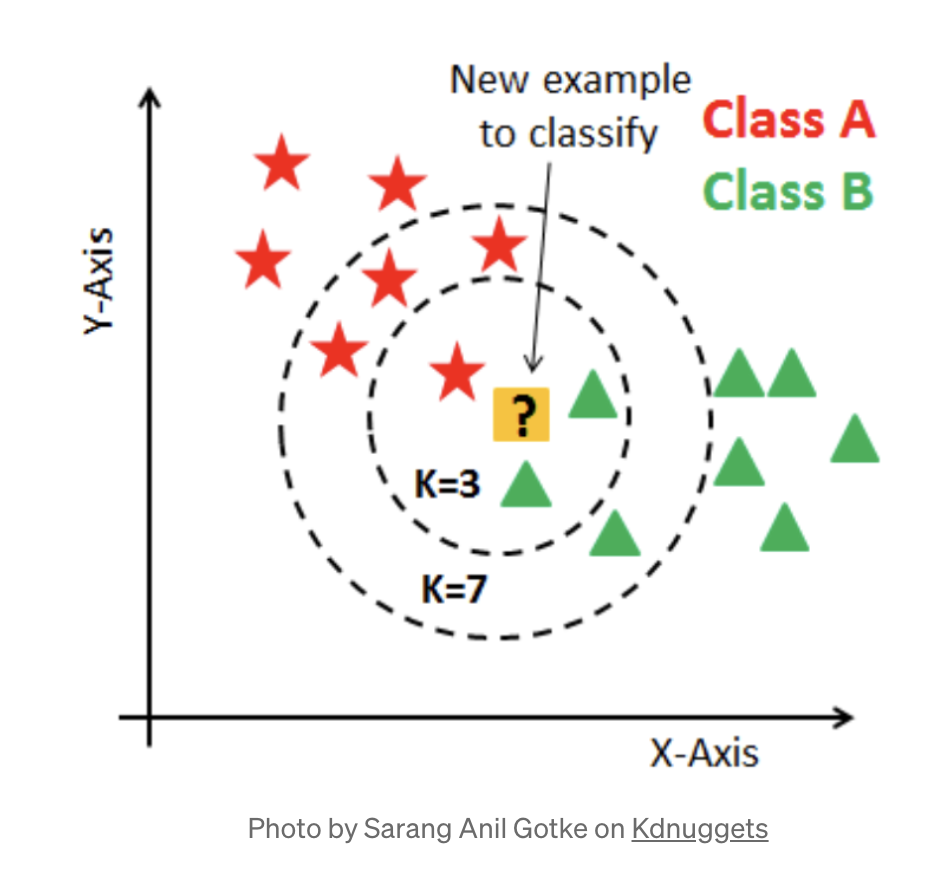
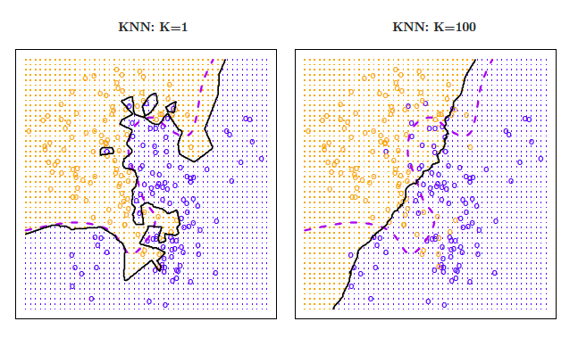

```{r echo=FALSE, message=FALSE, warning = FALSE}
library(tidyverse)
library(knitr)
library(RColorBrewer)
library(mosaic)
library(infer)
library(Metrics)


hook_output = knit_hooks$get('output')
knit_hooks$set(output = function(x, options) {
  # this hook is used only when the linewidth option is not NULL
  if (!is.null(n <- options$linewidth)) {
    x = xfun::split_lines(x)
    # any lines wider than n should be wrapped
    if (any(nchar(x) > n)) x = strwrap(x, width = n)
    x = paste(x, collapse = '\n')
  }
  hook_output(x, options)
})

```

### Announcements

**Mini Project 2**

- Due Tonight at 11:59 in Blueline

**Lab 5** (Linear Models)

- Due Tuesday March 24th at 11:59 pm in Blueline

**Quiz 3**: in class Thursday March 26th

- Covers: Prediction/KNN/Tree-Based Methods

---
### "Lazy" learning

__Lazy learning__: no assumptions necessary to classify data

<br>
<br>

__Example__: Consider the plot below - describe the relationship between x and y.

```{r, echo=FALSE, fig.align='center', fig.height=5, fig.width=9, fig.alt="Scatterplot of simulated data showing a moderately negative strenght relationship between x and y."}

set.seed(365)
x1 <- runif(min=0.1, max=0.5, n=20)
x2 <- runif(min=0.3, max=0.7, n=20)
x3 <- runif(min=0.5, max=0.9, n=20)
y1 <- runif(min=0.5, max=0.7, n=20)
y2 <- runif(min=0.4, max=0.6, n=20)
y3 <- runif(min=0.2, max=0.5, n=20)
x <- c(x1, x2, x3)
y <- c(y1, y2, y3)
group <- c(rep('A', 20), rep('B', 20), rep('C', 20))
data <- as.data.frame(cbind(x, y, group))
colnames(data) <- c('x', 'y', 'group')
data$x <- as.numeric(data$x)
data$y <- as.numeric(data$y)
ggplot(data, aes(x=x, y=y))+geom_point(size = 3)
```

---
### "Lazy" learning

What if the data points belonged to three different groups, like this? How should a new data point, $(0.2, 0.5)$ be classified? What about $(0.4, 0.2)$?

```{r, echo=FALSE, fig.align='center', fig.height=6.5, fig.width=12, fig.alt="Same scatterplot as previusly slide, but now points are colored based on 3 different groups. Additionally two additional points that are not classified into a group are displayed on the plot."}

new.pts <- data.frame(x = c(0.2, 0.4), y = c(0.5, 0.2), group=c('Point 1', 'Point 2'))
data.new <- rbind(data, new.pts)
ggplot(data.new, aes(x=x, y=y, group=group))+geom_point(size = 5, aes(col=group, pch=group))+scale_color_brewer(palette='Set1')
```

---
### Bayes Classifier

A good classifier minimizes Testing Error 

+ Bayes Classifier produce the lowest possible test error rate [(proof)](https://www.ee.columbia.edu/~vittorio/BayesProof.pdf)

Bayes Classifier assigns each observation to is most likely class using:

$$P(Y = j|X = x_0)$$
<br>
<br>
<br>

**Problem**: 

---
### $k$-nearest neighbor (KNN) classifier: 


A non-parametric supervised learning method that estimates the conditional probability.


.pull-left[
```{r, echo=FALSE, out.width="100%", fig.align='center', fig.alt="Depiction of how the choice of k can change classifications in KNN. When k=3, two of the three neighbors are green, so new point would also be green. However when k=7, four of the seven neighbors are red, so new point would now be classified as red."}

```
]
---
### KNN for Classification Steps

In the KNN algorithm, $k$ specifies the number of neighbors and its algorithm is as follows:


---
### `knn()`

__Example__: Let's classify our new points 

```{r}
library(class)
```


.pull-left[

$k=2$?

```{r}
knnMod1 = knn(train=data[,1:2], 
          test = new.pts[,1:2], 
          cl = data$group, 
          k = 2, prob = TRUE)
knnMod1
```

].pull-right[

 $k=10$?

```{r}
knnMod2 = knn(train =data[,1:2], 
          test = new.pts[,1:2], 
          cl = data$group, 
          k = 10, prob = TRUE)
knnMod2
```

]
---
### Advantages and Disadvantages of KNN

Advantages:

<br>
<br>
<br>

Disdvantages:


---
### Choice of k

```{r, echo=FALSE, out.width="75%", fig.align='center', fig.alt="Two figures depicting how the choice of k effects the decision boundary. When k = 1, the decision boundary between the two colors is overly flexible and follows the noise in the data. When k = 100, the decisicion boundary between the two colors is almost linear, not separting the groups well."}


```


---
### Example: Credit Utilization

__Example__: Use KNN to predict which utilization quantile a new customer falls into based on their application data (credit rating and age)? New applicants:

```{r, echo = FALSE}
library(ISLR)
data(Credit)
```

```{r, echo=FALSE}
Credit <- Credit %>% mutate(Utilization = Balance/Limit) %>% 
  mutate(Quartile = ifelse(Utilization<0.01851, 'Q1', 
                           ifelse(Utilization<0.09873, 'Q2',
                           ifelse(Utilization<0.14325, 'Q3','Q4'))))

```

```{r, eval=FALSE, fig.align='center', fig.height=6.5, fig.width=11, echo=FALSE, fig.alt="Scatterplot of Age vs Credit Rating where each points is colored by the utlization quantile a customer falls into. New points to classify are represented by a different shape."}

ggplot(Credit, aes(x=Age, y=Rating, group=Quartile)) + 
  geom_point(aes(col=Quartile, pch=Quartile), size = 3) + 
  scale_color_brewer(palette='Set1')
```

Name|Age|Credit Rating
---|---|---
Lacey|33|750
Zach|47|400
Ashlee|21|250

```{r, echo = FALSE}
apps <- data.frame(Age = c(33, 47, 21), 
                         Rating = c(750, 400, 250), 
                         Quartile=c('New', 'New', 'New'))
```


```{r, echo = FALSE}
old = Credit %>% dplyr::select(Age, Rating, Quartile)
full = rbind(old, apps)
full = full %>%
  mutate(Quartile = fct_relevel(Quartile,
                                "Q1", "Q2", "Q3", "Q4", "New"))
#str(full$Quartile)

```


```{r, fig.align='center', fig.height=4, fig.width=9, echo = FALSE}
ggplot(full, aes(x=Age, y=Rating, group=Quartile)) + 
  geom_point(aes(col=Quartile, pch=Quartile), size = 4) + 
  scale_color_brewer(palette='Set1')
```

---
### Example: Credit Utilization

.pull-left[
$k=20$?

```{r}
knn20 = knn(train = old[,1:2],
            test = apps[,1:2],
            cl = old[,3], 
            k = 20, prob = TRUE)
knn20
```

].pull-right[

$k=100$?

```{r}
knn100 = knn(train = old[,1:2],
            test = apps[,1:2],
            cl = old[,3], 
            k = 100, prob= TRUE)
knn100
```
]
---
### Example: Evaluate Prediction Accuracy

Is KNN an effective predictor of quartile using an applicant's age, credit rating, income, number of existing credit cards, and education level. Randomly selected 100 observations for testing, assigned the other 300 to training set.

```{r, echo=FALSE}
set.seed(365)
test_ID = sample(1:nrow(Credit), size = 100)
TEST = Credit[test_ID,]
TRAIN = Credit[-test_ID, ]

#only select variables we want
knn_train = TRAIN %>% dplyr::select(Age, Rating, Income, 
                                    Cards, Education)
knn_test = TEST %>% dplyr::select(Age, Rating, Income, 
                                  Cards, Education) 
```

```{r}
knn50 = knn(train = knn_train, 
            test = knn_test,
            cl = TRAIN$Quartile, 
            k = 50, prob = TRUE)
knn50
```

---
### Evaluate models: Classification Accuracy 

Now, we'll set the testing data as "new data", and make predictions using the k-nearest neighbors from the training data.

```{r}
#Create Confusion Matrix - Base R
t = table(knn50, TEST$Quartile)
t

sum(diag(t))/nrow(TEST) #Classification Accuracy
```

---
### Scaling Data


<br>
<br>
<br>
<br>
<br>

```{r}
knn_train_scale <- knn_train %>% scale()
knn_test_scale <- knn_test %>% scale()

knn50_scale = knn(train = knn_train_scale, 
            test = knn_test_scale,
            cl = TRAIN$Quartile, 
            k = 50, prob = TRUE)


t_scale = table(knn50_scale, TEST$Quartile)

sum(diag(t_scale))/nrow(TEST) #Classification Accuracy

```

---
### KNN for Regression 

KNN can also predict quantitative responses - alternative to Linear Regression

In the KNN algorithm, $k$ specifies the number of neighbors and its algorithm is as follows:


---
### Example: Credit Utilization


```{r}
knn_train = TRAIN %>% dplyr::select(Age, Rating, Income, Cards, 
                                    Education)
knn_test = TEST %>% dplyr::select(Age, Rating, Income, Cards, 
                                  Education) 

knn50 = FNN::knn.reg(train = knn_train, 
            test = knn_test,
            y = TRAIN$Utilization, 
            k = 50)

head(knn50$pred, n = 5)

Metrics::rmse(TEST$Utilization, knn50$pred)

```

---
### Linear Regression vs KNN Regression

**In General**: 


<br>
<br>
<br>
<br>

So in situations where the relationship is nonlinear, KNN regression may perform better than Linear Regression

- Curse of Dimensionality:

  
